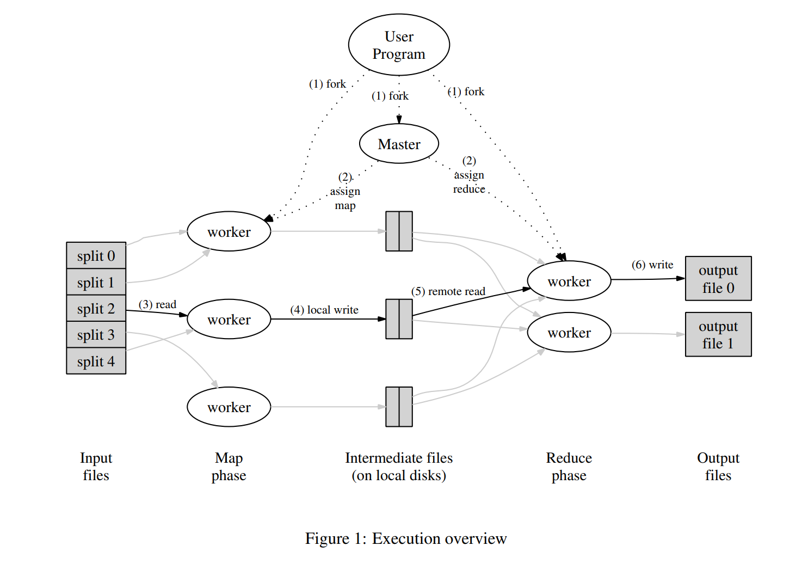

# lab1

### MapReduce

​

一个Coordinator(Master)给多个Worker分配任务（Map和Reduce），Worker向Coordinator请求任务并向Coordinator提交任务结果，Coordinator负责任务的发放以及状态的记录。

### 实验规则

1. Map阶段应该将中间键划分为nReduce个reduce任务的bucket，其中nReduce是reduce的任务数——main/mrcordinator.go传递给MakeCoordinator（）的参数。每个Map应创建nReduce个中间文件，以供reduce任务使用。
2. worker实现应该将第X个reduce任务的输出放在文件mr-out-X中。
3. mr-out-X文件应包含每个Reduce函数输出的一行。该行应使用Go“%v%v”格式生成，并使用键和值调用。在main/mrsequential.go中查看注释为“这是正确的格式”的行。如果您的实现与此格式偏离太多，测试脚本将失败。
4. 您可以修改mr/worker.go、mr/coordinator.go和mr/rpc.go。您可以临时修改其他文件进行测试，但要确保代码与原始版本兼容；我们将用原始版本进行测试。
5. worker应将中间Map输出放在当前目录中的文件中，您的Worker稍后可以将其作为Reduce任务的输入读取。
6. main/mrcordinator.go期望mr/coordinator.gif实现一个Done（）方法，该方法在MapReduce作业完全完成时返回true；此时，mrcoordinator.go将退出。
7. 作业完成后，Worker应退出。实现这一点的一个简单方法是使用call（）的返回值：如果Worker未能联系到Coordinator，则可以假设Coordinator已退出，因为作业已完成，因此Worker也可以终止。根据您的设计，您可能还会发现Coordinator可以向Worker提供“请退出”伪任务很有帮助。

### 提示

* 开始的第一个方法是修改mr/worker.go中的Worker()函数，该函数负责发送RPC向coordinator请求任务。如何修改coordinator，让其给worker分发还未开始进行的map任务的相关文件。之后去修改worker去读取这些文件内容，并调用Map函数，就像mrsequential.go做的那样。
* map和reduce函数在运行时通过Go plugin加载进来，就是.so文件。
* 你每次对mr/文件夹下的内容进行改变，都需要重新编译mapreduce的plugin，你都要重新输入命令：go build -race -buildmode=plugin ../mrapps/wc.go。
* 这个实验的worker要共享同一个文件系统。当worker运行在同一机器上时这一点非常显然，但是当worker运行在不同机器上，是需要一个像GFS一样的全局文件系统。
* 对于map产生的中间结果，存于文件当中，其作为reduce的输入，比较合理的文件名是mr-X-Y，其中X是map任务的序号，Y是reduce任务的序号。
* **worker的map任务结果要以key/value的键值对形式存于文件，同时reduce读取文件中内容也要以这种形式读取。在GO的encoding/json包中提供了函数，来写key/value键值对：**

```go
enc := json.NewEncoder(file)
for _, kv := ... {
    err := enc.Encode(&kv)
}
```

同时提供了如下函数，来读取key/value键值对：

```go
dec := json.NewDecoder(file)
for {
	var kv KeyValue
	if err := dec.Decode(&kv); err != nil {
		break
	}
	kva = append(kva, kv)
}
```

* 在map部分，worker可以通过ihash(key)函数（在worker.go中）来决定该key/value存于那个reduce任务文件中。
* 你可以从mrsequential.go中借鉴文件的读写，以及排序中间key/value键值对的程序。
* 对于coordinator，作为RPC服务端，是并发接受连接请求的，所以不用忘记对共享数据加锁。
* 使用Go的race探测器，也就是在编译和运行时使用-race，像go guild -race和go run -race。test-mr.sh脚本运行时已经加入了-race参数。
* worker有时候需要等待，比如说直到map的工作都结束才能开始reduce相关工作。一种可能的实现是worker每隔一段时间向coordinator请求工作，并在期间使用time.Sleep()。另一种可能的实现是在coordinator中的相关RPC处理函数使用time.Sleep()或sync.Cond等方式循环或等待。Go对每一个RPC都有自己的线程，所以这样的忙等待不会阻碍coordinator对其他RPC的处理。
* coordinator是不能完全区分worker到底是崩溃了，还是因为某些原因长时间停滞，比如执行过慢等。对worker长时间无反应的最好处理方法是，一旦你等待一段时间后，该worker依然未有反应，你可以放弃它，并把该worker正处理的任务交给其他worker。而在这个实验，coordinator将等待10秒，在worker10秒都未有反应后，coordinator假定这个worker已经died（当然，也可能这个worker还在工作着）。
* 如果你选择实现备份（论文section3.6），你的备份任务对应的时间间隔应该安排得更久（比如10秒以上），以免对我们的测试脚本的测试产生影响。（注：备份任务不会被测试）
* 为了测试是否克服崩溃，你可以使用mrapps/crash.go应用plugin，来随机在map或者reduce函数中退出。（注：测试脚本里已经提供相关测试）
* **为了保证在对文件进行写操作当发生崩溃时，人们不会看到多余的文件，MapReduce论文提到了相关技巧——使用临时文件，并且当文件写完后自动将该暂存文件重命名。你可以使用ioutil.TempFile来创建临时文件，使用os.Rename来对其进行重命名。**
* test-mr.sh在mt-tmp子目录下运行各进程，如果测试脚本提示错误，而你想查看中间文件和最终结果文件来了解发生了什么，你可以查看那个子目录。你可以调整test-mr.sh，使其在提示失败时退出（否则会继续测试，并且在子目录重新中间文件和最终文件）。
* test-mr-many.sh提供了一个带有超时的test-mr.sh的基本脚本。它将测试次数作为参数。你不能同时运行多个test-mr.sh，因为coordinator将会占用同一个socket，这会造成矛盾。

### 设计思路

#### `rpc.go`​

##### 任务

1. 完成RPC通信的结构体定义。（args，reply）

#### `worker.go`​

##### 任务

1. 完成对Coordinator的任务请求；
2. 对任务进行工作（map，reduce，wait）
3. Map和Reduce工作完之后，发送信号给Coordinator，通过RPC

#### `coordinator.go`​

##### 任务

1. 设计Coordinator的结构，锁
2. 分配任务（Map、Reduce、Wait）
3. 根据Worker的返回结果，对状态进行记录
4. 一直等待任务完成。

### rpc.go

```go
// Add your RPC definitions here.
const (
	TaskTypeMap int = iota
	TaskTypeReduce
	TaskTypeWait
	TaskTypeFinish
)

type WorkerArgs struct {
	MapTaskNumber    int // finished maptask number
	ReduceTaskNumber int // finished reducetask number
}

type WorkerReply struct {
	TaskType int // 0: map, 1: reduce, 2: wait, 3: finish
	NMap     int // number of map task
	NReduce  int // number of reduce task

	MapTaskNumber int    // map task only
	FileName      string // map task only

	ReduceTaskNumber int // reduce task only
}
```

### worker.go

```go
//
// main/mrworker.go calls this function.
//
func Worker(mapf func(string, string) []KeyValue,
	reducef func(string, []string) string) {

	// Your worker implementation here.

	// uncomment to send the Example RPC to the coordinator.
	// CallExample()
	for {
		args := WorkerArgs{}
		reply := WorkerReply{}
		ok := call("Coordinator.AllocateTask", &args, &reply)
		if !ok {
			// the coordinator may died
			log.Fatal("the coordinator may died")
			return
		}
		switch reply.TaskType {
		case TaskTypeMap:
			// doMapTask
		case TaskTypeReduce:
			// doReduceTask
		case TaskTypeWait:
			time.Sleep(time.Second)
		case TaskTypeFinish:
			return
		default:
			panic(fmt.Sprintf("unexpected jobType %v", reply.TaskType))
		}
	}
}
```

### coordinator.go

```go
type Coordinator struct {
	// Your definitions here.
	NReduce        int // number of reduce
	NMap           int // number of map
	Files          []string
	MapFinished    int        // number of finished map
	MapTaskLog     []int      // log of map; 0: not allocated, 1: waiting, 2: finished
	ReduceFinished int        // number of finished reduce
	ReduceTaskLog  []int      // log of reduce; 0: not allocated, 1: waiting, 2: finished
	mu             sync.Mutex // lock
}

// Your code here -- RPC handlers for the worker to call.
func (c *Coordinator) AllocateTask(args *WorkerArgs, reply *WorkerReply) error {
	c.mu.Lock()
	defer c.mu.Unlock()
	if c.MapFinished < c.NMap {
		// map task
	} else if c.ReduceFinished < c.NReduce {
		// reduce task
	} else {
		reply.TaskType = 3
	}
	return nil
}

func (c *Coordinator) ReceiveFinishedMap(args *WorkerArgs, reply *WorkerReply) error {
	c.mu.Lock()
	defer c.mu.Unlock()
	c.MapFinished++ // finished map count ++
	c.MapTaskLog[args.MapTaskNumber] = 2
	return nil
}

func (c *Coordinator) ReceiveFinishedReduce(args *WorkerArgs, reply *WorkerReply) error {
	c.mu.Lock()
	defer c.mu.Unlock()
	c.ReduceFinished++ // finished reduce count ++
	c.ReduceTaskLog[args.ReduceTaskNumber] = 2
	return nil
}
```

### Test Result

```bash
pjm@pjm2001:~/6.5840/src/main$ bash test-mr.sh 
*** Starting wc test.
--- wc test: PASS
*** Starting indexer test.
--- indexer test: PASS
*** Starting map parallelism test.
--- map parallelism test: PASS
*** Starting reduce parallelism test.
--- reduce parallelism test: PASS
*** Starting job count test.
--- job count test: PASS
*** Starting early exit test.
--- early exit test: PASS
*** Starting crash test.
--- crash test: PASS
*** PASSED ALL TESTS
```

‍
