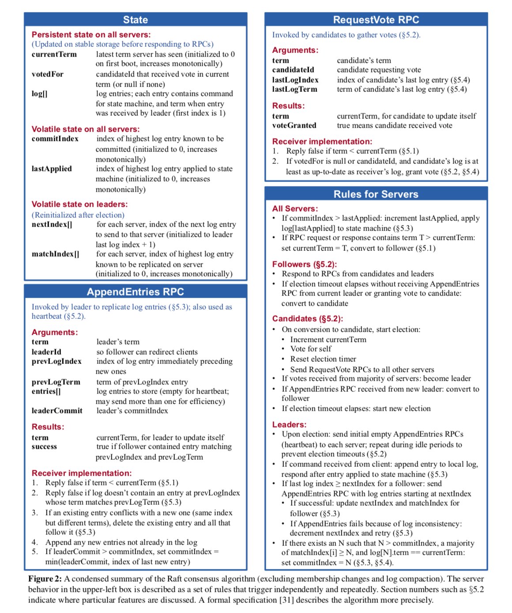
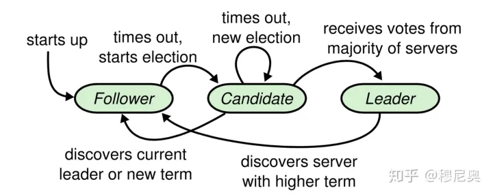

<!-- ---
title: lab2A: Raft-Leader Election
date: 2023-03-18T20:53:30Z
lastmod: 2023-03-19T20:00:28Z
--- -->

# lab2A: Leader Election

​​

### 需要实现的部分

```go
func:
	defined:
		Make() {}
		Raft.GetState() {}
		Raft.RequestVote() {}
		Raft.ticker() {}

	undefined:
		Raft.startElection() {}
		Raft.collectVotes() {}
		Raft.getGrantedVotes() {}
		Raft.sendHeartBeats() {}
		Raft.AppendEntries() {}
		Raft.isHeartBeatTimeOut() bool {}
		getRandElectionTimeOut() time.Duration {}

struct:
	Raft{}
	RequestVoteArgs{}
	RequestVoteReply{}
	AppendEntriesArgs{}
	AppendEntriesReply{}
```

### 流程

​​

#### Follower

* 响应来自Candidate和Leader的RPC请求
* 如果等待时间超过选举超时的情况下，没有收到Leader的心跳发送，或者投票给某个候选人，进入投票Candidate状态

#### Candidate

从Follower进入到Candidate状态：

* 增加当前的Term
* 给自己投票
* 重新设置选举时间
* 发送RPC，向其他的服务器请求投票

如果获得大量选票，成为Leader

如果收到新Leader的AppendEntries RPC，转换为Follower

如果选举超时，发起新的一轮选举

#### Leader

成为Leader后，每隔一段`heartBeatTimeOut`​时间向其Follower发送一个心跳（`AppendEntriesArgs{}`​包），告知仍然存活

由多数Candidate选举产生

### 注意事项

1. 关于选举间隔时间：建议 150 ~ 300 之间

    * 设置太高会浪费空闲时间
    * 设置太低又容易发生活锁，也存在一种情况就是leader选举出来了，但是又收到term更高的vote rp请求。

2. 当选leader，应该尽快发送心跳rpc，防止follower过期
3. leader 发送心跳的频率 ， 建议在100ms以上一次，官方建议1s不超过10次
4. 一把大锁保护好状态，RPC期间释放锁，RPC结束后注意状态二次判定
5. request/response都要先判断term > currentTerm，转换follower
6. 一个currentTerm只能voteFor其他节点1次
7. 注意candidates请求vote的时间随机性
8. 注意requestVote得到大多数投票后立即结束等待剩余RPC
9. 注意成为leader后尽快appendEntries心跳，否则其他节点又会成为candidates
10. 注意几个刷新选举超时时间的逻辑点
11. 初始化的currentTerm为0

### 实现

#### 定义常量

```go
const (
	Follower  = 1
	Candidate = 2
	Leader    = 3

	ElectionSleepTime = 30 * time.Millisecond  // 选举睡眠时间 ms
	HeartBeatSendTime = 110 * time.Millisecond // 心跳包发送时间 ms

	ElectionTimeOutMin = 150 // 选举超时最小时间 ms
	ElectionTimeOutMax = 300 // 选举超时最大时间 ms
)
```

### 推荐阅读

[1] [[MIT6.824 lab2] Raft-Leader election 代码实现 &amp; 踩坑记录](https://juejin.cn/post/7109291073226145806#heading-13)​

[2] [运行 3000 次都不出错的 MIT 6.824 Raft 实验](https://zhuanlan.zhihu.com/p/368433074)​

‍
