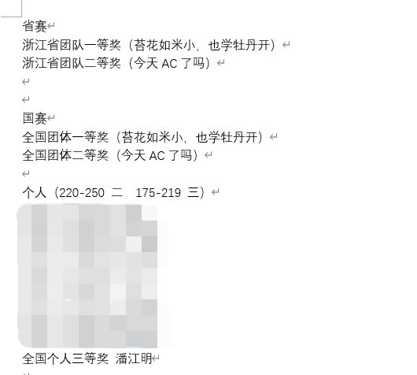

## 初识算法竞赛
进入大学前的暑假，在MOOC上跟着浙江大学的翁恺老师学习了C语言。学完之后离开学还有些日子，还去尝试了浙江大学陈越姥姥的数据结构课（但由于当时非常的菜，没怎么听明白）。

一次偶然的机会，在网上刷到了关于计算机学生建议参加的竞赛，于是，算法竞赛走进了我的生活。

---

## 我的大一
### 我被我校ACM协会拒绝了
入学后，协会的招新信息没有通知到我所在的学院（经管学院）。百团大战那天，我很茫然的发现，ACM协会并没有来，原来已经招过新了，不再补招，于是，我被 **“拒绝”** 了。

### 我的第一场校赛
那是2020年的CCCC校赛选拔赛，只能做一些模拟题，水平是非常非常的有限，并且暑假后我并没有写过多少代码，好在暑假的代码量支撑我拿到了大一新生中的三等奖，同时获得了小礼品，一盏台灯。
但是呢，最终由于水平有限，未能入选。

### 关于转专业
比赛后，我便专心投入到转专业的事情中，好在专业课没有拉跨，并且数学成绩优异，虽然面试的时候出现了一点小插曲（同时也导致现在也不喜欢当时面试我的老师），最后还是轻轻松松的转入了现在的专业，计算机科学与技术。并且报了校选修课课——算法优化，开始正式的踏上算法竞赛之路。

我开始跟着紫书（刘汝佳的《算法竞赛入门经典》）开始一步步学习算法，发现此书对我来说还是有点难度颇高了，但是其中的模拟题，对于当时的我来说，是真的使我的编码能力得到了很大的提高。

同时，也会偶尔参加codeforces的比赛，体验过掉分的痛苦，也体验过比赛时成功AC一题的惊喜。

期间和浙大宁波理工学院的朋友聊过是选择算法竞赛or数学建模，最后还是选择了算法竞赛，感谢胡向东同学的鼓励！

> 在写这段内容时（2022.4.18），惊喜发现，在算法竞赛这条路上，我已经走了快一年了。

### 我的第二场校赛
时间来到了2021年的CCCC校内选拔赛，经过前段时间的训练，能力上也有所增长，通过了选拔，并作为三队成员，参加了我的第一场真正的算法竞赛。

### 2021CCCC
那天我们大一的学生，得去主校区参加比赛。早起坐上校车后，心里一直在幻想比赛的场景和主校区的风景。三个小时的比赛很快就过去了，最后成绩一般般，但是让我由衷的体会到了算法竞赛的魅力与快乐，更坚定的选择了算法竞赛这条道路。

### 入选ACM集训队
虽然是入选了，但是校赛打的是极其的糟糕，最后凭借着经常的训练记录侥幸入选。

在暑假参加了杭电的中国大学生超级联赛和牛客网举办的暑期多校训练联盟，也报了Acwing的算法课，算法能力在这个暑假得到了巨大的提高。

---

## 我的大二
### 2021 ICPC 上海站
上海站于2021年11月27-28日举行，作为我人生中第一场ICPC，紧张之余留有一丝期待，但是最终上海站过于神仙打架以及自身实力实在是过于薄弱，取得了一个一般般的成绩。

我的第一场ICPC以打铁为结局。

#### 赛时剪影

### 第十三届蓝桥杯
#### 校赛
校赛本着随便进的心态，并没有很认真的去打，一个小时内就把除了最后一题的所有题目都做完了，最后实在想不出最后一题该如何下手，便提前离场。最后获得了校二等奖，殊不知，真正的厄运开始了。

#### 省赛
蓝桥杯省赛于2022年4月9日举行，此次蓝桥杯的题目质量明显提高，虽然有多道是原题，但是能感觉到蓝桥杯正在往高难度的方向去发展，而不是以往的“暴力杯”。最后由于进制大题实在谜语以及可能出现的其他错误，仅获得浙江省蓝桥杯C++B组二等奖，无缘国赛。

### 浙江省第十九届大学生程序设计竞赛
浙江省赛于2022年4月16日举行，这场实话实说，运气占了很大一部分。我队过题速度快且罚时少，并且对于马拉车板子，在比赛时临场学会，一次通过。

本来省赛能摘一枚铜牌就知足了，实在没有料到，最后拿到了一块宝贵的银牌🥈，并且拿了全校第一，全省本科组第52名的成绩。

### 2021 ICPC 昆明站
昆明站于2022年4月17日举行。谁有能想到省赛的第二天就是昆明站呢？对于昆明站，我队表现极差，虽说开局很快过掉了签到题，但是由于选题失误，浪费大量时间，错失了拿牌机会。

知耻而后勇吧🙏

### 第七届“中国高校计算机大赛-团体程序设计天梯赛”
天梯赛于2022年4月23日举行。本届天梯赛的题目质量也非常好，虽说比赛时一度想摆烂不打了，但是最后还是挺住了压力，拿到了人生的第一个算法竞赛国奖。所在团队的队友也十分给力，一起拿下了省二和国二。

### 总结大二
大二这一年，我实现了算法竞赛奖牌从零的突破。唯一不足的是并没有获得 金牌/一等奖/🥇 ，希望我的大三能够坚持下去，再接再厉。 