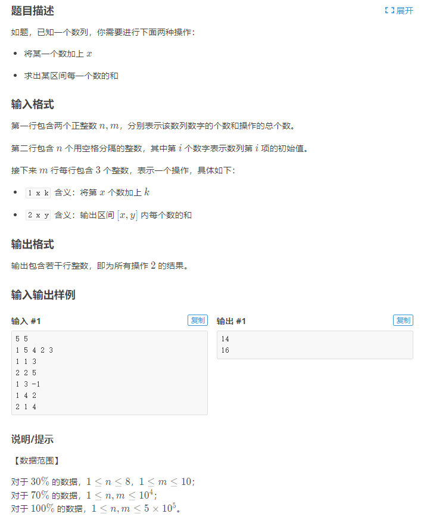
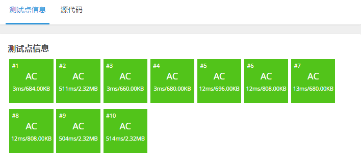

[原题链接](https://www.luogu.com.cn/problem/P3374)

#### 题目详情


---

### 算法与思路
这是一道裸模板题，只需要根据[前文](/algorithm/bit/1)所讲的操作写一遍即可。

---

### 代码
```cpp
#include <bits/stdc++.h>
using namespace std;

const int N = 500010;

int n, m;
int tr[N];

int lowbit(int x) {
	return x & -x;
}

void add(int x, int k) {
	for (int i = x; i <= n; i += lowbit(i))
		tr[i] += k;
}

int sum(int x) {
	int res = 0;
	for (int i = x; i; i -= lowbit(i))
		res += tr[i];
	return res;
}

int main() {
	cin >> n >> m;
	for (int i = 1; i <= n; i++) {
		int x; cin >> x;
		add(i, x);
	}

	int op, x, y;
	while (m--) {
		cin >> op >> x >> y;
		if (op == 1) add(x, y);
		else cout << sum(y) - sum(x - 1) << '\n';
	}

	return 0;
}
```

#### 运行结果
