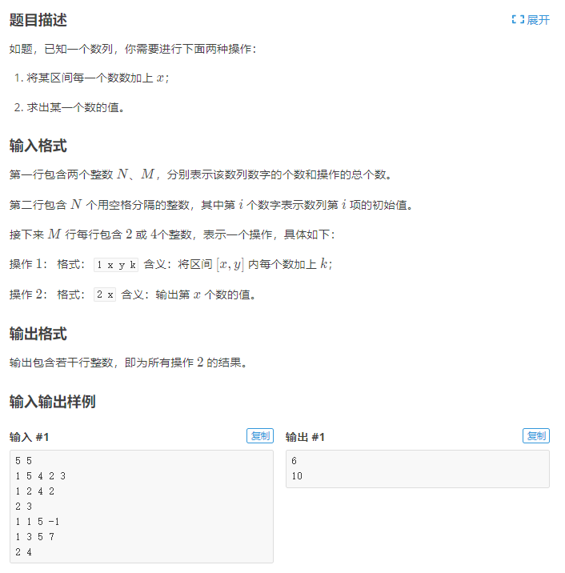
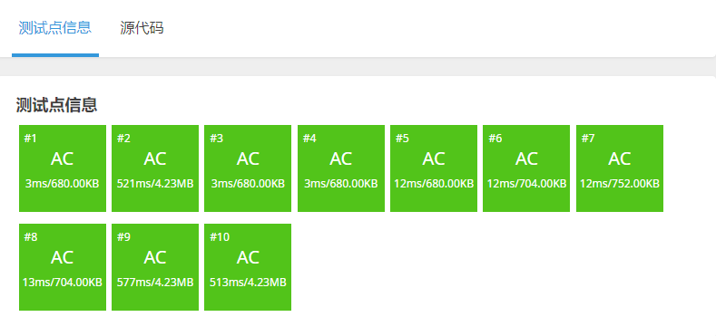

[原题链接](https://www.luogu.com.cn/problem/P3368)

#### 题目详情


#### 数据范围
- $1 \le n,m \le 500000$
- $1 \le x,y \le n$
- 保证任意时刻序列中任意元素的绝对值都不大于 $2^{30}$

---

### 算法与思路
#### 差分
先来介绍一下差分

设数组 $a=\{1,6,8,5,10\}$，那么差分数组 $b=\{1,5,2,-3,5\}$

也就是说 $b[i]=a[i]-a[i-1](a[0]=0)$，那么 $a[i]=b[1]+....+b[i]$

假如区间 $[2,4]$ 都加上 $2$ 的话

$a$ 数组变为 $a=\{1,8,10,7,10\}$，$b$ 数组变为 $b=\{1,7,2,-3,3\}$

其中，$b$ 数组只有 $b[2]$ 和 $b[5]$ 变了，因为区间 $[2,4]$ 是同时加上2的,所以在区间内 $a[i]-a[i-1]$ 是不变的.

所以对区间 $[x,y]$ 进行修改,只用修改 $b[x]$ 与 $b[y+1]$:

$b[x]=b[x]+k$

$b[y+1]=b[y+1]-k$

因此，本题可以用树状数组维护一个差分序列。

---

### 代码
```cpp
#include <bits/stdc++.h>
using namespace std;

const int N = 500010;

int n, m;
int a[N], tr[N];

int lowbit(int x) {
	return x & -x;
}

void add(int x, int k) {
	for (int i = x; i <= n; i += lowbit(i))
		tr[i] += k;
}

int sum(int x) {
	int res = 0;
	for (int i = x; i; i -= lowbit(i))
		res += tr[i];
	return res;
}

int main() {
	cin >> n >> m;
	for (int i = 1; i <= n; i++) {
		cin >> a[i];
		add(i, a[i] - a[i - 1]);
	}

	int op, x, y, k;
	while (m--) {
		cin >> op;
		if (op == 1) {
			cin >> x >> y >> k;
			add(x, k);
			add(y + 1, -k);
		} else {
			cin >> x;
			cout << sum(x) << '\n';
		}
	}

	return 0;
}
```

#### 运行结果
