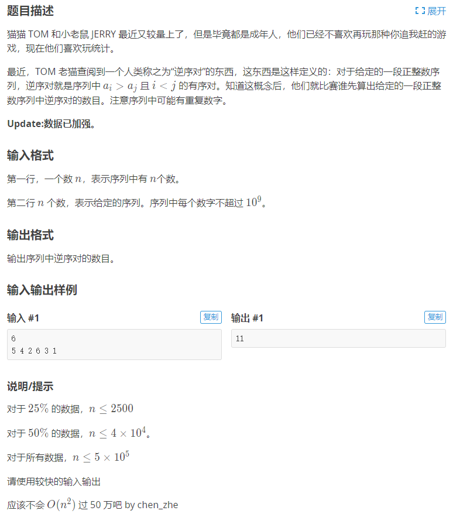
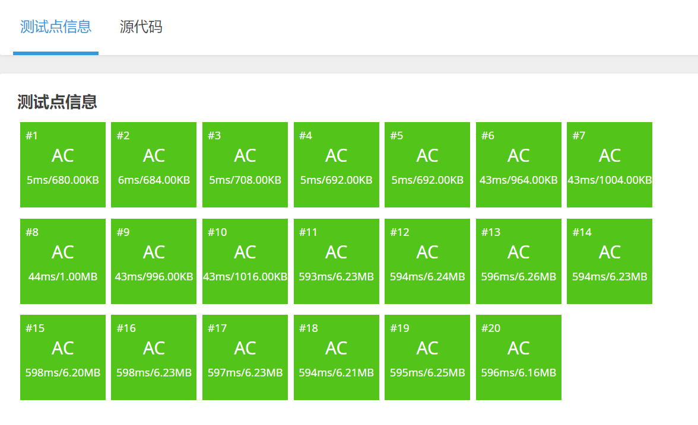

[原题链接](https://www.luogu.com.cn/problem/P1908)

#### 题目详情


---

### 算法与思路
#### 离散化(Discretization)
在以前介绍的树状数组中，只需要开一个与原序列中最大元素相等的长度数组就行，那么如果我的序列是1，5，3，8，999，本来5个元素，却需要开到999这么大，造成了巨大的空间浪费，

离散化就是另开一个数组$d$，$d[i]$用来存放第 $i$ 小的数在原序列的什么位置，比如原序列 $a=\{999,333,444,21,1\}$，第一小就是1，他在 $a$ 中的位是5，所以 $d[1]=5$，同理 $d[2]=3$，...，所以 $d$ 数组为 $d=\{5,3,4,2,1\}$，

具体实现：
```cpp
for (int i = 1; i <= n; i++) {
    scanf("%d", &a[i]);
    v.push_back(a[i]);
}

sort(v.begin(), v.end());
v.erase(unique(v.begin(), v.end()), v.end());

for (int i = 1; i <= n; i++)
    a[i] = upper_bound(v.begin(), v.end(), a[i]) - v.begin();
```

#### 树状数组求和
根据上面的步骤每一次把一个新的数x放进去之后，都要求比他大的元素有几个，而比他大的元素个数一定是 $x+1$ 到 $n$ 中存在数的个数，也就是 $[x+1,n]$ 中有几个数，是不是很耳熟，有点像之前讲的前缀和了，只不过树状数组 $tr$ 表是的不是前缀和了，$tr[x]$ 表示的是 $[1,x]$ 中有几个数已经存在，这样我们每次把一个新的数 $x$ 放进去的时候，都需要把包含这个数的结点更新，然后查询 $[x+1,n]$ 有几个数已经存在。

即 $ans=sum(n)-sum(x)$

具体实现：
```cpp
LL res = 0;
for (int i = 1; i <= n; i++) {
    res += sum(n) - sum(a[i]);
    add(a[i], 1);
}
```

---

### 代码
```cpp
#include <bits/stdc++.h>
using namespace std;

using i64 = long long;

const int N = 500010;

int n;
int w[N], tr[N];
vector<int> v;

inline int lowbit(int x) {
	return x & -x;
}

void add(int x, int k) {
	for (int i = x; i <= n; i += lowbit(i))
		tr[i] += k;
}

int sum(int x) {
	int res = 0;
	for (int i = x; i; i -= lowbit(i))
		res += tr[i];
	return res;
}

int main() {
	cin >> n;
	for (int i = 1; i <= n; i++) {
		cin >> w[i];
		v.push_back(w[i]);
	}

	sort(v.begin(), v.end());
	v.erase(unique(v.begin(), v.end()), v.end());

	for (int i = 1; i <= n; i++)
		w[i] = upper_bound(v.begin(), v.end(), w[i]) - v.begin();

	i64 res = 0;
	for (int i = 1; i <= n; i++) {
		res += sum(n) - sum(w[i]);
		add(w[i], 1);
	}

	cout << res << endl;

	return 0;
}
```

#### 运行结果
