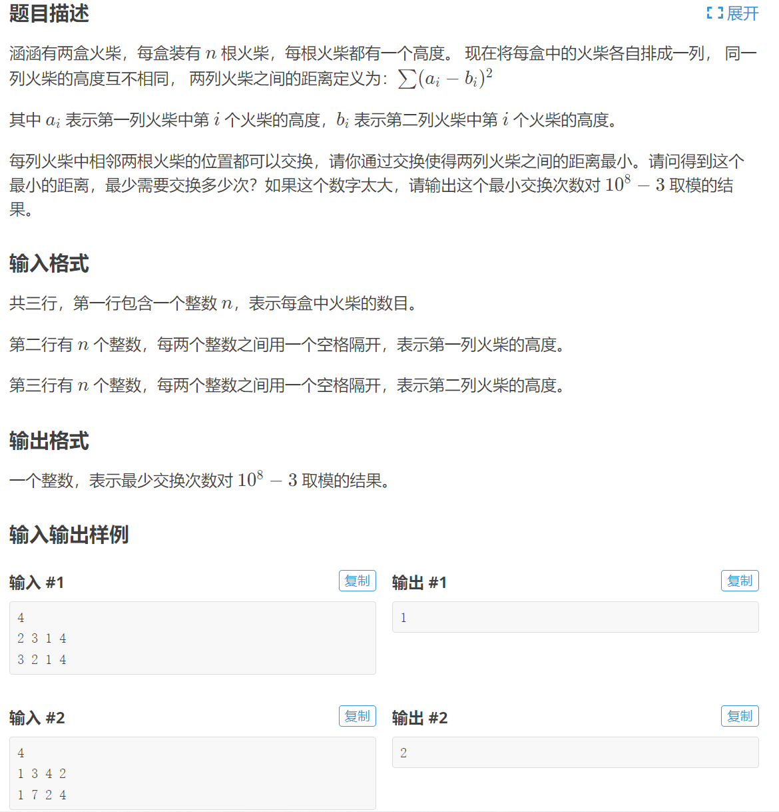
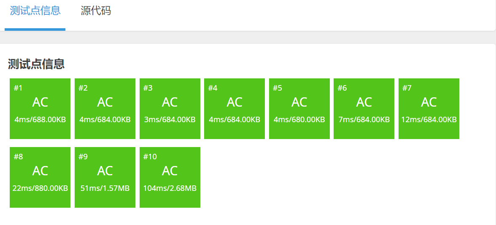

[原题链接](https://www.luogu.com.cn/problem/P1966)

#### 题目详情


#### 数据范围
- $1 \le n \le 10^5$
- $0 \le$ 火柴高度 $< 2^{31}$

---

### 算法与思路
我们需要最小化 $\sum_{i=1}^{n} (a_i - b_i)^2$，也就是说 $a$ 序列第 $k$ 大的元素必须与 $b$ 序列第 $k$ 大的元素($k \in [1,n]$)的位置必须一样。

我们对于每个序列，存储两个信息，一个是序列的值，另一个是序列输入时的下标。

我们按序列的值从小到大排序后，便可以确定序列中第 $k$ 大的元素的原始下标是多少，此时我们新建序列 $c$，$c[a[i].id]=b[i].id$，相当于以序列 $a$ 为关键字对 $b$ 序列排序。若序列 $a$ 等于序列 $b$，此时 $c[a[i]]=a[i]$，即 $c[i]=[i]$。

因此，如果需要使两个序列相等，即 $c$ 序列升序排列。

问题就转化成，将原本乱序的 $c$ 序列升序排列的最少交换次数。

求升序排列的最小交换次数，即为求序列中逆序对的数量。用树状数组即可快速求出。

---

### 代码
```cpp
#include <bits/stdc++.h>
using namespace std;

#define ff first
#define ss second

typedef pair<int, int> PII;

const int N = 100010;
const int mod = 1e8 - 3;

int n;
PII a[N], b[N];
int c[N], tr[N];

inline int lowbit(int x) {
	return x & -x;
}

inline void add(int x, int k) {
	for (int i = x; i <= n; i += lowbit(i))
		tr[i] = (tr[i] + k) % mod;
}

inline int sum(int x) {
	int res = 0;
	for (int i = x; i; i -= lowbit(i))
		res = (res + tr[i]) % mod;
	return res;
}

int main() {
	cin >> n;
	for (int i = 1; i <= n; i++) cin >> a[i].ff;
	for (int i = 1; i <= n; i++) cin >> b[i].ff;
	for (int i = 1; i <= n; i++)
		a[i].ss = b[i].ss = i;

	sort(a + 1, a + n + 1);
	sort(b + 1, b + n + 1);

	for (int i = 1; i <= n; i++)
		c[a[i].ss] = b[i].ss;

	int res = 0;
	for (int i = 1; i <= n; i++) {
		res = (res + sum(n) - sum(c[i])) % mod;
		add(c[i], 1);
	}

	cout << res << '\n';

	return 0;
}
```

#### 运行结果
