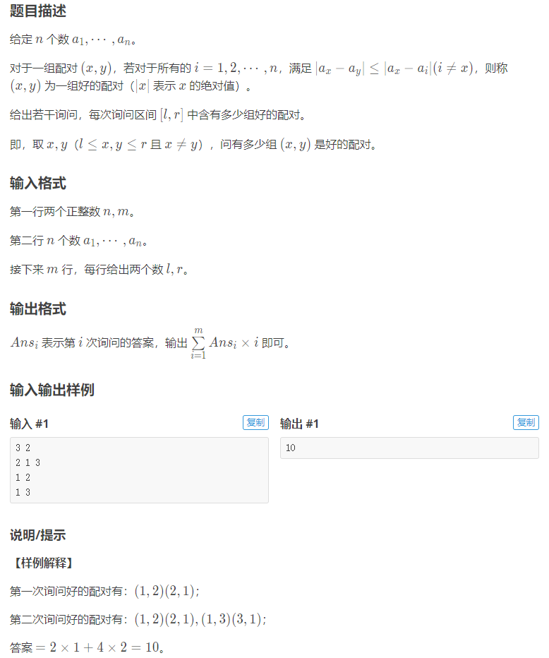
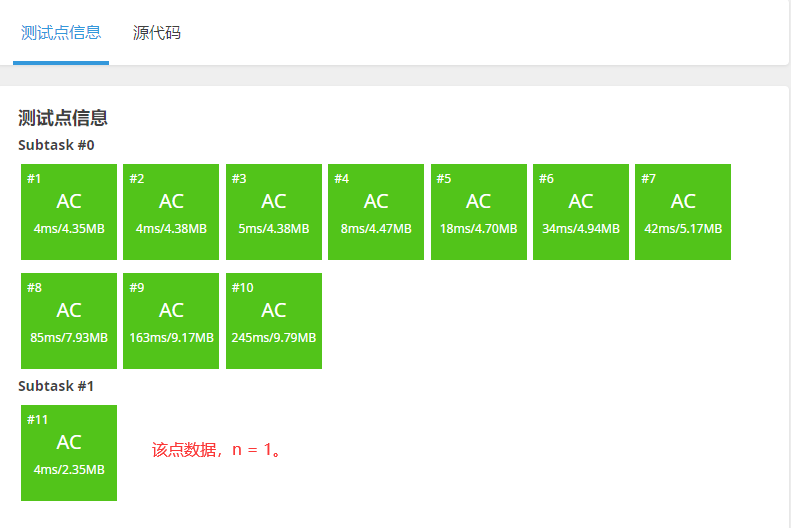

[原题链接](https://www.luogu.com.cn/problem/P5677)

#### 题目详情


#### 数据范围
- $1 \le n,m \le 300000$
- $1 \le a_i \le 10^9$
- $i \ne j,a_i \ne a_j$

---

### 算法与思路
#### 寻找所有好对

首先我们来理解题意：

$\left\vert a_x-a_y\right\vert \le \left\vert a_x-a_i\right\vert(i\ne x)$ ，就是说 $a_x$ 和 $a_y$ 对于 $a_x$ 是相差最小两个数，放到数轴上就是挨得最近的两个数。

所以就想到了排序，这样每个数可能的好对就是它和它两边的两个数。

举个例子：

$$3,9,11,4,8,6$$

编号

$$1,2,3,4,5,6$$

排序过后就变成

$$3,4,6,8,9,11$$

对应的编号是

$$1,4,6,5,2,3$$

对于每一个数，判断一下它与它左右两边的数的差的绝对值：

如果相等，那么就是两个好的配对（左右两边都是好对），以6为例：

$\left\vert 6-4\right\vert = \left\vert 6-8\right\vert$ $6$ 和 $4$ 对应的好对为 $(6,4)$，$6$ 和 $8$ 对应的好对为 $(6,5)$。

如果不相等，那么只有绝对值之差更小的一对，以 $4$ 为例：

$\left\vert 4-3\right\vert < \left\vert 4-6\right\vert$ 只有 $4$ 和 $3$ 的好对 $(4,1)$ 。

当然两边的数只有唯一的一对

要注意的是，如果一个配对 $(x,y)$ 是好对， $(y,x)$ 不一定是好对，如9和11： $(3,2)$ 是好对，而 $(2,3)$ 就不是。

数据约束中说到当 $i \ne j,a_i \ne a_j$，即 $a$ 中没有相同的元素，这样就保证了这个配对判断的正确性。

至此我们已经找到了所有的配对，时间复杂度 $O(n \log n)$ （瓶颈在排序）。

#### 查询所有询问
对于每次查询，我们只把右端点在 $(0,r]$ 内的好对放进树状数组。

树状数组 $tr[i]$ 表示左端点在 $[i-\operatorname{lowbit}(i)+1 , i]$ 内的所有好对的的个数。

已经放入的好对个数，减去左端点在 $(0,l-1]$ 内的好对（也就是减去 $\operatorname{query}(l-1)$ ），就可以得到答案了。

举个例子：


实线表示该好对在树状数组中，虚线表示该好对还未放入树状数组。

待查询的区间 $[L,R]$ 如图所示，此时只有 $q_1,q_2$ 两个好对在R左侧，再减去左端点在L左侧的 $q_1$ ，就得到 $[L,R]$ 内的好对数目：1个（ $q_2$ ）。

我们再将所有的好对和所有的询问，都按右端点从小到大排个序。

每次R右移，就将右端点小于等于R的所有好对，都加入到树状数组里，再减去左端点在 $(0,l-1]$ 内的好对个数就是答案。


此时R右移， $q_3,q_4$被放入树状数组，再减去左端点在L左侧的 $q_1,q_3$，就得到 $[L,R]$ 内的好对数目：2个（$q_2,q_4$）。

遍历每个询问$O(n)$，每次查询$O(\log n)$,总时间复杂度$O(n \log n)$。

#### 统计答案
因为答案的计算方法很特殊， $\sum_{i=1}^mAns_i \times i$

所以我们在给询问排序的时候也要记录下它原先的 $i$ （代码中为 $pos$ ）。

$Ans_i$的计算方法上文已经讲得很清楚了，这里不再多说。

整体时间复杂度 $O(n \log n)$ 。

---

### 代码
```cpp
#include <bits/stdc++.h>
using namespace std;
using i64 = long long;

const int N = 300010;

int n, m, tot;
int tr[N];
struct node {
	int val, id;
	bool operator < (const node &t) const {
		return val < t.val;
	}
} w[N];

struct match {
	int l, r;
	bool operator < (const match &t) const {
		if (r != t.r) return r < t.r;
		return l < t.l;
	}
} p[N << 1];

struct query {
	int l, r, id;
	bool operator < (const query &t) const {
		if (r != t.r) return r < t.r;
		return l < t.l;
	}
} q[N];

void add_match(node a, node b) {
	int l = min(a.id, b.id);
	int r = max(a.id, b.id);
	p[++tot] = {l, r};
}

inline int lowbit(int x) {
	return x & -x;
}

inline void add(int x, int k) {
	for (int i = x; i <= n; i += lowbit(i))
		tr[i] += k;
}

inline i64 sum(int x) {
	i64 res = 0;
	for (int i = x; i; i -= lowbit(i))
		res += tr[i];
	return res;
}

int main() {
	cin >> n >> m;
	for (int i = 1; i <= n; i++) {
		cin >> w[i].val;
		w[i].id = i;
	}

	if (n == 1) {
		cout << "0\n";
		return 0;
	}

	sort(w + 1, w + 1 + n);

	add_match(w[1], w[2]);
	add_match(w[n], w[n - 1]);
	for (int i = 2; i < n; i++) {
		int diff1 = w[i].val - w[i - 1].val;
		int diff2 = w[i + 1].val - w[i].val;
		if (diff1 < diff2) add_match(w[i], w[i - 1]);
		else if (diff1 > diff2) add_match(w[i + 1], w[i]);
		else {
			add_match(w[i], w[i - 1]);
			add_match(w[i], w[i + 1]);
		}
	}

	sort(p + 1, p + 1 + tot);

	for (int i = 1; i <= m; i++) {
		int l, r;
		cin >> l >> r;
		q[i] = {l, r, i};
	}

	sort(q + 1, q + 1 + m);

	i64 res = 0;
	for (int i = 1, j = 1; i <= m; i++) {
		while (j <= tot && p[j].r <= q[i].r) {
			add(p[j].l, 1);
			j++;
		}
		res += (sum(q[i].r) - sum(q[i].l - 1)) * q[i].id;
	}

	cout << res << '\n';

	return 0;
}
```

#### 运行结果
