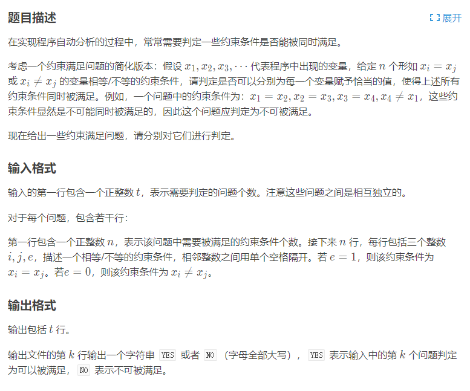

[原题链接](https://www.luogu.com.cn/problem/P1955)

#### 题目详情


#### 数据范围
- $1\le n\le 100000$
- $1\le i,j\le 10^9$
- $e\in\{0,1\}$

---

### 算法与思路
#### 并查集
对于 $x_1=x_2$ 的情况，我们可以认为 $x_1$ 和 $x_2$ 在同一个集合内。

对于 $x_1\ne x_2$ 的情况，我们可以认为 $x_1$ 和 $x_2$ 不在同一个集合内。

同时 $x_1=x_2$ 是可以看成无向的，即 $x_2=x_1$。因此可以用并查集来处理此题。

#### 离散化
我们注意到变量 $i,j\le 10^9$，用并查集开长度为 $10^9$ 的数组是不现实的。

而 $n$ 的范围只有 $10^5$，因此我们需要对数据进行离散化。

---

### 代码
```cpp
#include <bits/stdc++.h>
using namespace std;
using i64 = long long;

const i64 N = 200010;

i64 n, m;
i64 p[N];
unordered_map<i64, i64> S;
struct query {
	i64 x, y, e;
} q[N];

i64 get(i64 x) {    // 离散化
	if (!S.count(x)) S[x] = ++n;
	return S[x];
}

i64 find(i64 x) {   // 并查集
	return p[x] == x ? p[x] : p[x] = find(p[x]);
}

void solve() {
	S.clear();
	n = 0;

	cin >> m;
	for (i64 i = 0; i < m; i++) {
		i64 x, y, e;
		cin >> x >> y >> e;
		q[i] = {get(x), get(y), e};
	}

	for (i64 i = 1; i <= n; i++) p[i] = i;

	for (i64 i = 0; i < m; i++) {
		if (q[i].e == 1) {
			i64 pa = find(q[i].x), pb = find(q[i].y);
			p[pa] = pb;
		}
	}

	bool ok = true;
	for (i64 i = 0; i < m; i++) {
		if (q[i].e == 0) {
			i64 pa = find(q[i].x), pb = find(q[i].y);
			if (p[pa] == p[pb]) {
				ok = false;
				break;
			}
		}
	}

	if (ok) cout << "YES\n";
	else cout << "NO\n";
}

int main() {
	ios::sync_with_stdio(false);
	cin.tie(nullptr);

	i64 T;
	cin >> T;
	while (T--) {
		solve();
	}

	return 0;
}
```

#### 运行结果
