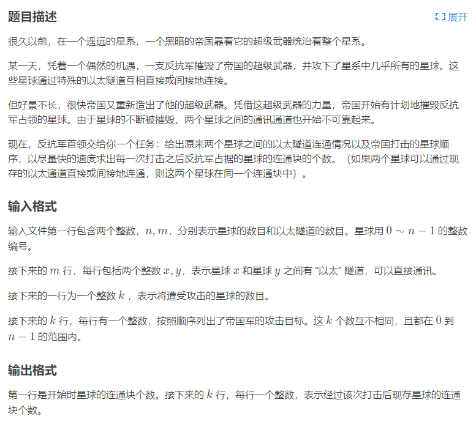
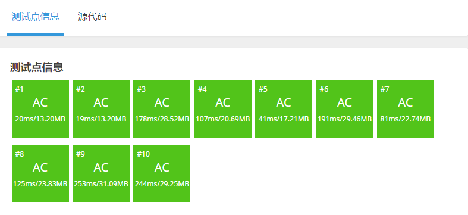

[原题链接](https://www.luogu.com.cn/problem/P1197)

#### 题目详情


#### 数据范围
- $1\le m\le 2\times 10^5$
- $1\le n\le 2\times m$
- $x\ne y$

---

### 算法与思路
并查集的合并操作很简单，但是把并查集内部元素分开就比较困难。

因此，我们可以采取逆向思维，把 **摧毁** 变为 **修复** 。

---

### 代码
```cpp
#include <bits/stdc++.h>
using i64 = long long;

#define ff first
#define ss second

typedef std::pair<i64, i64> PII;

const i64 N = 400010;

i64 n, m, k;
i64 p[N];
PII edge[N];
bool st[N];
std::vector<i64> h[N];

i64 find(i64 x) {	// 并查集寻找父节点+路劲压缩
	return p[x] == x ? p[x] : p[x] = find(p[x]);
}

void solve() {
	memset(st, true, sizeof st);	// 初始所有星球都是存在的
	std::cin >> n >> m;
	for (i64 i = 0; i < m; i++) {
		i64 x, y;
		std::cin >> x >> y;
		h[x].push_back(y);
		h[y].push_back(x);
		edge[i] = {x, y};
	}

	for (i64 i = 0; i < n; i++) p[i] = i;	// 并查集初始化

	std::cin >> k;
	std::stack<i64> S;
	for (i64 i = 0; i < k; i++) {
		i64 x;
		std::cin >> x;
		st[x] = false;	// 星球被摧毁
		S.push(x);
	}


	i64 res = n - k;	// 现在连通块为存在的星球
	for (i64 i = 0; i < m; i++) {
		i64 x = edge[i].ff, y = edge[i].ss;
		if (st[x] && st[y] && find(x) != find(y)) {	
            // 如果星球存在并且不属于同一连通块
			res--;
			p[find(x)] = find(y);	// 合并
		}
	}

	std::vector<i64> ans;
	ans.push_back(res);

	while (!S.empty()) {
		i64 u = S.top();
		S.pop();

		st[u] = true;	// 新增一个星球，res++
		res++;

		for (i64 it : h[u]) {	// 寻找u点的所有出边
			if (st[it] && find(u) != find(it)) {
				res--;
				p[find(it)] = find(u);
			}
		}

		ans.push_back(res);
	}

	std::reverse(ans.begin(), ans.end());	// 翻转答案

	for (i64 it : ans) std::cout << it << '\n';
}

int main() {
	std::ios::sync_with_stdio(NULL);
	std::cin.tie(nullptr);

	solve();

	return 0;
}
```

#### 运行结果
