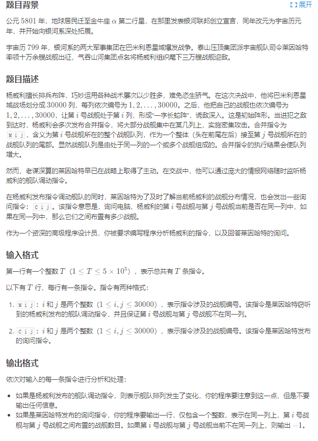
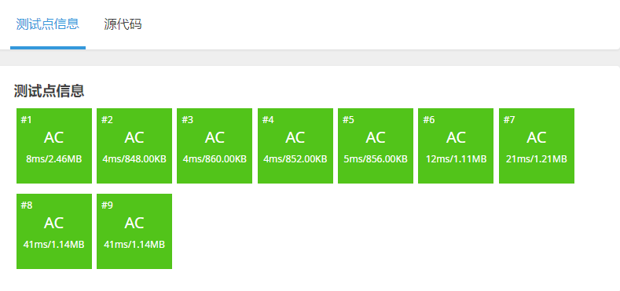

[原题链接](https://www.luogu.com.cn/problem/P1196)

#### 题目详情


---

### 算法和思路
并查集可以用于维护具有传递性关系的作用，每个集合的大小，绑定到根结点上，每个点到根结点的距离，绑定到每个元素的结点上。

我们定义 `p[]` 存储每个点的祖宗节点，`d[]` 存储 `x` 到 `p[x]` 的距离，`size[]` 表示 `x` 所在集合的大小。

将第a列的船接到第b列的末尾，相当于让每个 `a` 列的船到 `pa` 的距离加上 `size[pb]`，由于存储并查集中存在路径压缩的效果，因此只需要将 `pa` 到 `pb` 的距离加上 `size[pb]` 即可，即 `d[pa] = size[pb]`。


---

### 代码
```cpp
#include <bits/stdc++.h>
using i64 = long long;

const i64 N = 30010;

i64 n, m;
i64 p[N], size[N], d[N];

i64 find(i64 x) {
	if (p[x] != x) {
		i64 u = find(p[x]);
		d[x] += d[p[x]];
		p[x] = u;
	}
	return p[x];
}

void solve() {
	std::cin >> m;
	for (i64 i = 1; i <= 30000; i++) {
		p[i] = i;
		size[i] = 1;
	}

	char op;
	i64 x, y;
	while (m--) {
		std::cin >> op >> x >> y;

		i64 pa = find(x), pb = find(y);
		if (op == 'M') {
			d[pa] = size[pb];
			size[pb] += size[pa];
			p[pa] = pb;
		} else {
			std::cout << (pa == pb ? std::max(std::abs(d[x] - d[y]) - 1, 0ll) : -1) << '\n';
		}
	}
}

int main() {
	std::ios::sync_with_stdio(false);
	std::cin.tie(nullptr);

	solve();

	return 0;
}
```

#### 运行结果
