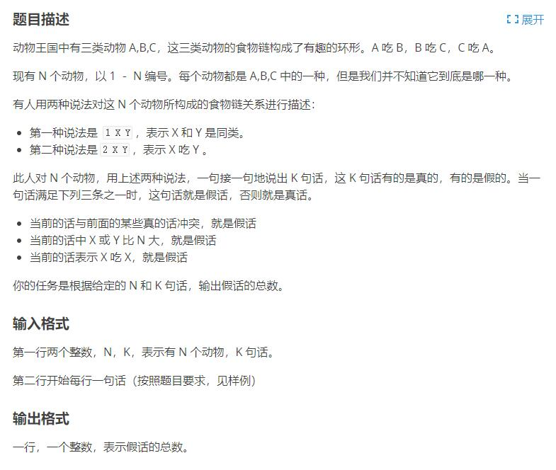

[原题链接](https://www.luogu.com.cn/problem/P2024)

#### 题目详情


#### 数据范围
- $1\le N\le 5\times 10^4$
- $1\le K\le 10^5$

---

### 算法与思路
对于询问是否在同一类或者不同类之间关系的题目，可以用并查集来维护。

对于A，B，C三种动物，可以通过维护与父节点的距离 `d[]` 来判断同类或捕食关系。即：

- 当动物 $x$ 和动物 $y$ 的距离 $\bmod3$ 等于 $1$ 时,说明 $x$ 捕食 $y$；
- 当动物 $x$ 和动物 $y$ 的距离 $\bmod3$ 等于 $2$ 时,说明 $y$ 捕食 $x$；
- 当动物 $x$ 和动物 $y$ 的距离 $\bmod3$ 等于 $0$ 时,说明 $x$ 和 $y$ 是同类。

#### 如何判断假话
##### 情况(1) x，y 不在编号内
$$(x>n) \lor (y>n)$$

##### 情况(2) x 与 y 是同类，但是 x 吃 y
因为合并 $x$ 和 $y$ 所在集合多出了一段长度

这块长度是 $find(x)$ 到 $find(y)$ 的距离

所以求多出来的这块部分的长度

当 $x$ 和 $y$ 是同类时,有这样的特性

$(len[x]+len[find[x]]-len[y])\bmod 3\equiv 0$

这里的 $len[x]$ 是还未合并时, $x$ 到 $find[x]$ 的距离

$\therefore len[find[x]]=len[y]-len[x]$

##### 情况(3) x 吃 y，但是 x 与 y 是同类
- 当 $x$ 和 $y$ 在一个集合中时，且 $x$ 捕食 $y$，则

    $x$ 到根节点的距离 - $y$ 到根节点的距离 = $1+3k$, $k$为任意实数

    $\therefore$ 当 $(len[x]-len[y]-1-3k)\bmod 3\equiv 0$ 时可确认 $x$ 捕食 $y$

- 当 $x$ 和 $y$ 不在同一集合时，设 $find(x)$ 到 $find(y)$ 的距离为 $len([find(x)])$

    此时有 $len[x]+len([find(x)])-len[y]=3k+1$

    $\therefore len[find(x)]=-len[x]+len[y]+1+3k$

#### 对于`d[i]`真正的含义及 `find()` 函数调用过程


---

### 代码
```cpp
#include <bits/stdc++.h>
using i64 = long long;

const i64 N = 50010;

i64 n, m;
i64 p[N], d[N];

i64 find(i64 x) {
	if (p[x] != x) {
		i64 t = find(p[x]);
		d[x] += d[p[x]];
		p[x] = t;
	}
	return p[x];
}

void solve() {
	std::cin >> n >> m;

	for (i64 i = 1; i <= n; i++) p[i] = i;

	i64 res = 0;
	while (m--) {
		i64 op, x, y;
		std::cin >> op >> x >> y;

		if (x > n || y > n) res++;  // 情况1
		else {
			i64 pa = find(x), pb = find(y);
			if (op == 1) {
				if (pa == pb && (d[x] - d[y]) % 3) res++;   // 情况2
				else if (pa != pb) {
					p[pa] = pb;
					d[pa] = d[y] - d[x];
				}
			} else {
				if (pa == pb && (d[x] - d[y] - 1) % 3) res++;   // 情况3
				else if (pa != pb) {
					p[pa] = pb;
					d[pa] = d[y] + 1 - d[x];
				}
			}
		}
	}

	std::cout << res << '\n';
}

int main() {
	std::ios::sync_with_stdio(false);
	std::cin.tie(nullptr);

	solve();

	return 0;
}
```

#### 运行结果
