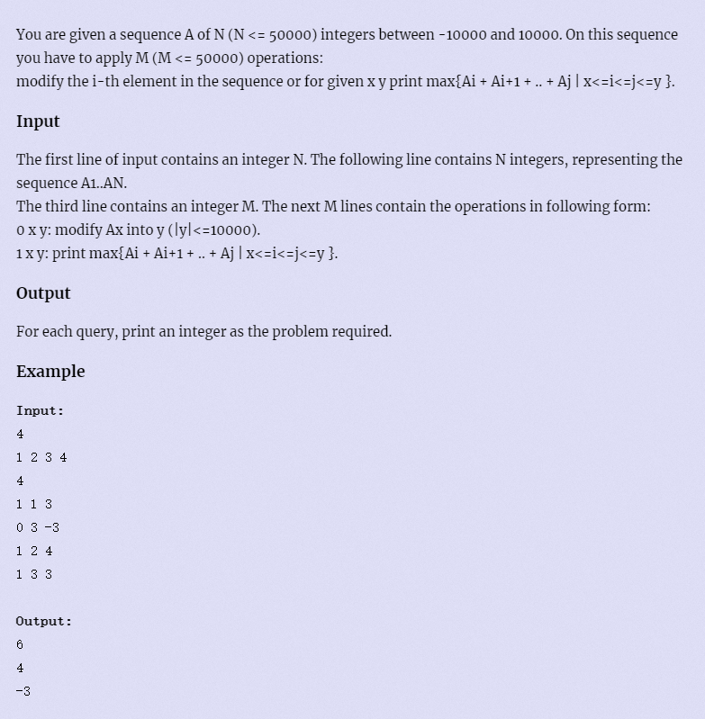
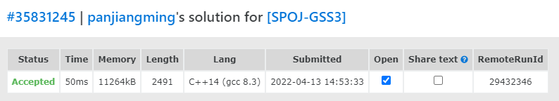

[原题链接](https://vjudge.net/problem/SPOJ-GSS3)

#### 题目描述


#### 题目翻译

给定长度为 $N$ 的数列 $A$，以及 $M$ 条指令，每条指令可能是以下两种之一：

- `0 x y`，把 $A[x]$ 改成 $y$。

- `1 x y`，查询区间 $[x,y]$ 中的**最大连续子段和**，即 

$$\max_{x \le l \le r \le y}\sum_{i = l}^r A[i]$$

对于每个查询指令，输出一个整数表示答案。

#### 数据范围
- $N≤500000,M≤500000$
- $−10000≤A[i],\ y≤10000$

---

### 算法与思路

首先，确定线段树节点所包含的信息。要求区间内**最大连续子段和**，因此线段树节点中必须要有一个数 $tmax$ 用来存储当前区间 $[l, r]$ 的**最大连续字段和**。

考虑子节点向父节点转移，单独有 $tmax$ 并不够。当父节点的**最大连续子段和**是跨越左右子节点时，并不能保证可以直接由 $tmax$ 转移过来。

此时我们需要左子节点的**最大后缀和** {$rmax$} 以及右子节点的**最大前缀和** {$lmax$}。

由于左右子节点互相独立，因此向父节点转移的 $tmax$ 无非是以下三种情况：

1. 左子节点的**最大连续子段和** $l.tmax$；
2. 右子节点的**最大连续子段和** $r.tmax$；
3. 左子节点的**最大后缀和** {$l.rmax$} + 右子节点的**最大前缀和** {$r.lmax$}。

父节点 $u.tmax$ 即为：

$$u.tmax = max(l.rmax + r.lmax,\ max(l.tmax,\ r.tmax));$$

---

那么父节点的 $lmax$ 和 $rmax$ 是否可以通过**当前已知信息**直接转移呢？答案是**不能**。

父节点的**最大前缀和** $lmax$ 可能会是以下两种情况：

1. 左子节点的**最大前缀和** $l.lmax$；
2. 左子节点的**全部元素和** $\sum_{i=l}^{mid} A[i]$ + 右子节点的**最大前缀和** $r.lmax$。

即

$$u.lmax=max(l.lmax,\ l.sum+r.lmax);$$

同理，父节点的**最大后缀和**的两种情况为：

1. 右子节点的**最大后缀和** $r.rmax$；
2. 右子节点的**全部元素和** $\sum_{i=mid+1}^{r} A[i]$ + 左子节点的**最大后缀和** $l.rmax$。

即

$$u.rmax=max(r.rmax,\ r.sum+l.rmax);$$

由上述可见，我们还需要一个 $sum$ 来存储当前节点**区间内所有元素的和**。而父节点的 $sum$ 可以直接由左右子节点的 $sum$ 计算得出。

即

$$u.sum=l.sum+r.sum;$$

---

#### 线段树节点 $node$
```cpp
/************************************
*   sum : sum of [l, r]             *
*   lmax: 最大前缀和                 *
*   rmax: 最大后缀和                 *
*   tmax: 区间[l, r]最大连续子段和    *
************************************/
struct node {
    int l, r;
    int sum, lmax, rmax, tmax;
} tr[N * 4];
```

---

#### pushup操作
```cpp
void pushup(node &u, node &l, node &r) {
    u.sum = l.sum + r.sum;
    u.lmax = max(l.lmax, l.sum + r.lmax);
    u.rmax = max(r.rmax, r.sum + l.rmax);
    u.tmax = max(l.rmax + r.lmax, max(l.tmax, r.tmax));
}

void pushup(int u) {
    pushup(tr[u], tr[u << 1], tr[u << 1 | 1]);
}
```

这里使用了重载函数操作，简洁代码。

---

#### 建树操作
回到最初题目要求，建立一颗区间为 $[1,n]$ 的线段树。

当 $l=r$ 时，题目要求该区间内至少含有一个数($l \le r$)，因此当前节点的 $tmax, lmax, rmax, sum$ 都为 $A[r]$。

- $tr[u].l = l;$
- $tr[u].r = r;$
- $tr[u].lmax = tr[u].rmax = tr[u].tmax = tr[u].sum = w[r]$

同时，也要注意，每次递归完左右子节点后，要将当前父节点的信息修改，即 执行 `pushup(u)` 操作。
```cpp
void build(int u, int l, int r) {
    if (l == r) tr[u] = {l, r, w[r], w[r], w[r], w[r]}; // 找到叶子节点
    else {
        tr[u] = {l, r};                 // 设当前节点区间为[l, r]
        int mid = l + r >> 1;
        build(u << 1, l, mid);          // 建立左子树
        build(u << 1 | 1, mid + 1, r);  // 建立右子树
        pushup(u);                      // 修改父节点
    }
}

int main() {
    cin >> n;
    for (int i = 1; i <= n; i++) cin >> w[i];

    build(1, 1, n);

    cin >> m;
    int op, x, y;
    while (m--) {
        cin >> op >> x >> y;
        if (op == 0) {
            // 修改
        } else {
            // 查询
        }
    }

    return 0;
}
```

---

#### 修改操作
每次从 $1$ 号节点开始找，找到位置位于 $x$ 的数，把它修改为 $v$。

设已找到位于 $x$ 处的节点，记为 $tr[u]$。

易得知当前区间即为 $[x,x]$，题目要求该区间内至少含有一个数($l \le r$)，修改 $A[x]=y$，因此当前节点的 $tmax, lmax, rmax, sum$ 都为 $v=y=A[x]$。

- $tr[u].l = tr[u].r = x;$
- $tr[u].lmax = tr[u].rmax = tr[u].tmax = tr[u].sum = v$

```cpp
void modify(int u, int x, int v) {
    if (tr[u].l == x && tr[u].r == x) tr[u] = {x, x, v, v, v, v};   // 找到了
    else {
        int mid = tr[u].l + tr[u].r >> 1;
        if (x <= mid) modify(u << 1, x, v); // x位于当前区间的左半子区间
        else modify(u << 1 | 1, x, v);      // x位于当前区间的右半子区间
        pushup(u);                          // 修改父节点的相关信息
    }
}
```

---

#### 查询操作
查询的时候我们会遇到四种情况。

1. 当前节点区间被 $[l,r]$ 所包含，即返回当前节点的信息 `return tr[u];`

2. 查询的区间在当前节点的**左半区间** ($r \le mid$)，

    递归搜索左子树，即 `query(u << 1, l, r);`

3. 查询的区间在当前节点的**右半区间** ($l > mid$)，
    
    递归搜索右子树，即 `query(u << 1 | 1, l, r);`

4. 查询的区间**横跨左右区间**，递归搜索左子树和右子树，最后将搜索得到的 $left$ 和 $right$ 子树的信息合并，得到当前节点 $res$ 的信息，即 `pushup(res, left, right);`，最后返回 $res$ 即可。

由上述可知，`query`函数不能单单只返回一个 $int$ 型变量，应该返回整个节点的信息，所以定义`query`函数的返回类型为 $node$。

```cpp
node query(int u, int l, int r) {   // 从节点u开始，查找区间[l, r]的信息
    // 1. 包含在区间内
    //      Tl-----Tr
    //   L-------------R  
    if (tr[u].l >= l && tr[u].r <= r) return tr[u];

    int mid = tr[u].l + tr[u].r >> 1;

    // 2. 在当前的左半区间
    //    Tl-----m-----Tr
    //      L---R
    if (r <= mid) return query(u << 1, l, r);

    // 3. 在当前的右半区间
    //    Tl-----m-----Tr
    //              L-----R
    else if (l > mid) return query(u << 1 | 1, l, r);

    // 4. 两边都有，都查询
    //     Tl----m----Tr
    //        L-----R 
    else {
        auto left = query(u << 1, l, r);
        auto right = query(u << 1 | 1, l, r);
        node res;
        // 合并答案
        pushup(res, left, right);
        return res;
    }
}
```

---

#### 具体转移流程


---

### 代码(无注释)
```cpp
#include <bits/stdc++.h>
using namespace std;

const int N = 500010;

int n, m;
int w[N];
struct node {
	int l, r;
	int tmax, lmax, rmax, sum;
} tr[N * 4];

void pushup(node &u, node &l, node &r) {
	u.sum = l.sum + r.sum;
	u.lmax = max(l.lmax, l.sum + r.lmax);
	u.rmax = max(r.rmax, r.sum + l.rmax);
	u.tmax = max(l.rmax + r.lmax, max(l.tmax, r.tmax));
}

void pushup(int u) {
	pushup(tr[u], tr[u << 1], tr[u << 1 | 1]);
}

void build(int u, int l, int r) {
	if (l == r) tr[u] = {l, r, w[r], w[r], w[r], w[r]};
	else {
		tr[u] = {l, r};
		int mid = l + r >> 1;
		build(u << 1, l, mid);
		build(u << 1 | 1, mid + 1, r);
		pushup(u);
	}
}

void modify(int u, int x, int v) {
	if (tr[u].l == x && tr[u].r == x) tr[u] = {x, x, v, v, v, v};
	else {
		int mid = tr[u].l + tr[u].r >> 1;
		if (x <= mid) modify(u << 1, x, v);
		else modify(u << 1 | 1, x, v);
		pushup(u);
	}
}

node query(int u, int l, int r) {
	if (tr[u].l >= l && tr[u].r <= r) return tr[u];

	int mid = tr[u].l + tr[u].r >> 1;
	if (r <= mid) return query(u << 1, l, r);
	else if (l > mid) return query(u << 1 | 1, l, r);
	else {
		auto left = query(u << 1, l, r);
		auto right = query(u << 1 | 1, l, r);
		node res;
		pushup(res, left, right);
		return res;
	}
}

int main() {
	cin >> n;
	for (int i = 1; i <= n; i++) cin >> w[i];

	build(1, 1, n);

	cin >> m;
	int op, x, y;
	while (m--) {
		cin >> op >> x >> y;
		if (op == 0) {
			modify(1, x, y);
		} else {
			cout << query(1, x, y).tmax << endl;
		}
	}

	return 0;
}
```

#### 运行结果
