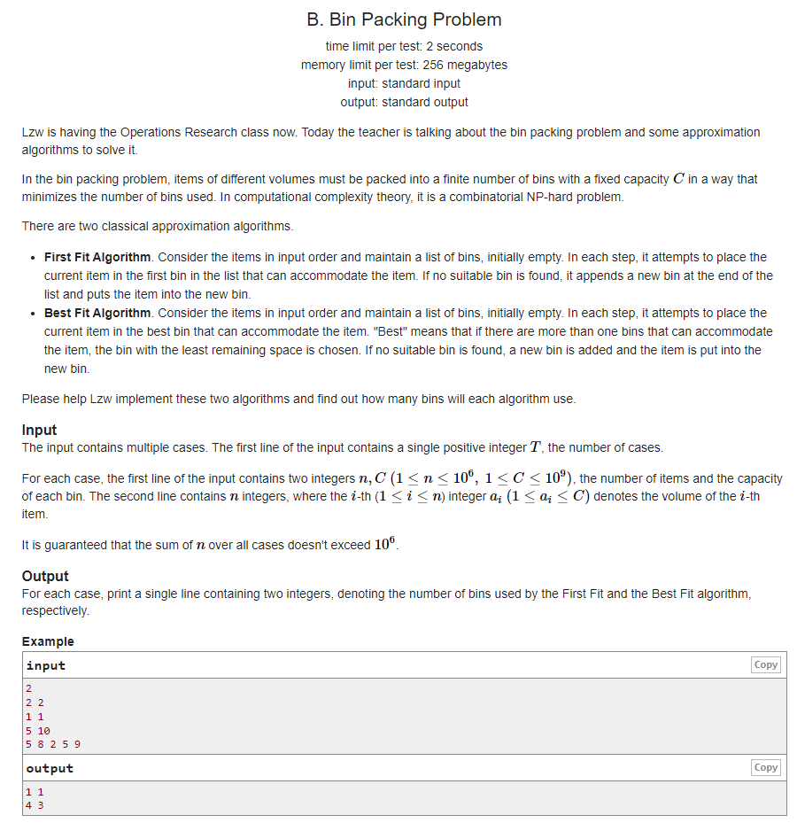

[原题链接](https://codeforces.com/gym/102770/problem/B)

#### 题目描述


#### 题目翻译
有 $n$ 个物品，每个物品的容量为 $a[i]$，有一种箱子（无数个），每个箱子的容量为 $C$，将物品装入箱中，按照如下装法，请问最少各需要多少个箱子：

1. **第一种**：每次选择从前往后找到第一个余下空间能够装下当前物品的箱子，把物品装入其中，若没找到，则增加一个箱子，将物品装入增加的箱子中。
2. **第二种**，每次选择余下空间最小的且能装下当前物品的箱子，若不存在则增加一个箱子，将物品装入增加的箱子中。

#### 数据范围
- $1≤n≤10^6, 1≤C≤10^9$
- $1 \le a_i \le C$

---

## 算法与思路

### 问题一
对于每次查询，我们需要找到第一个剩余容量大于等于 $a[i]$ 的盒子，然后将物品放入该盒子内。

换句话说，就是每次查询到区间内第一个大于等于 $a[i]$ 的数，并且修改它。

区间内快速查询，单点修改，我们可以很自然的想到线段树此类数据结构。

首先，构造节点。我们需要 $l,r$ 来表示当前区间，选取 $v$ 来表示区间内的最大值。

[前文](/algorithm/segmentTree/2/)已经证明，节点仅包含 $v$ 时，父节点可以从左右子节点更新信息，求出当前父节点区间内的最大值。

#### 写出节点 $node$
```cpp
struct node {
	int l, r;
	int v;  // 区间[l, r]内的最大值
} tr[N << 2];
```

#### 状态转移函数 `pushup(int u)`
```cpp
void pushup(int u) {
	tr[u].v = max(tr[u << 1].v, tr[u << 1 | 1].v);
}
```

---

#### 建树操作
我们需要选择多大的区间来建树呢？

首先最坏的情况会是如何？最坏的情况应该是，有 $n$ 个物品，需要 $n$ 个箱子来存储。即每个物品的体积，都为箱子的最大容量。

因此，建树的时候，我们选择 $[1,n]$ 的区间。选择箱子容量 $C$ 作为每个节点的初始值。
```cpp
void build(int u, int l, int r) {
	tr[u] = {l, r};
	if (l == r) {
		tr[u].v = c;
		return;
	}
	int mid = l + r >> 1;
	build(u << 1, l, mid);
	build(u << 1 | 1, mid + 1, r);
	pushup(u);  // 最后更新当前节点的最值
}
```

---

#### 询问 & 修改
我们每次查询的时候，需要查询区间内**第一个**大于等于查询数 $x$ 的数。如何保证查询到的数是第一个大于等于 $x$ 的数呢？

根据线段树节点的左右子节点互相独立，互不干扰的性质，我们可以先搜左子树，如果左子树的最大值大于等于 $x$，那么就搜左子树，否则，搜右子树。这样可以保证，查询结果总是在前面的。

我们应该如何存储答案呢？定义一个全局变量 $ans$，当查询到的数等于箱子容量C时，即需要一个新的箱子来放入物品，`ans++`。

我们可以发现，在找到目标数后，可以直接进行对**箱子剩余容量**进行修改，因此我们可以把修改操作直接写入询问函数中。
```cpp
void query(int u, int x) {
	if (tr[u].l == tr[u].r) {
		if (tr[u].v == c) ans++;    // 需要一个新箱子
		tr[u].v -= x;   // 修改当前箱子容量
		return;
	}
	if (tr[u << 1].v >= x) query(u << 1, x);    // 左子树可以查询
	else query(u << 1 | 1, x);  // 查询右子树
	pushup(u);  // 修改当前节点最值
}
```

---

### 问题二
我们可以维护一个 $multiset$ 存储箱子的剩余容量，每次用 `lower_bound` 来查找大于等于x的数。
```cpp
multiset<int> S;
for (int i = 0; i < n; i++) {
    auto it = S.lower_bound(a[i]);
    if (it == S.end()) S.insert(c - a[i]);  // 需要一个新的箱子存储
    else {
        int x = (*it) - a[i];   // 修改当前箱子容量
        S.erase(it);
        S.insert(x);
    }
}
```

---

## 代码
```cpp
#include <bits/stdc++.h>

using namespace std;

const int N = 1000010;

int n, c, ans;
int a[N];
struct node {
	int l, r;
	int v;
} tr[N << 2];

void pushup(int u) {
	tr[u].v = max(tr[u << 1].v, tr[u << 1 | 1].v);
}

void build(int u, int l, int r) {
	tr[u] = {l, r};
	if (l == r) {
		tr[u].v = c;
		return;
	}
	int mid = l + r >> 1;
	build(u << 1, l, mid);
	build(u << 1 | 1, mid + 1, r);
	pushup(u);
}

void query(int u, int x) {
	if (tr[u].l == tr[u].r) {
		if (tr[u].v == c) {
			ans++;
		}
		tr[u].v -= x;
		return;
	}
	if (tr[u << 1].v >= x) query(u << 1, x);
	else query(u << 1 | 1, x);
	pushup(u);
}

void solve() {
	scanf("%d%d", &n, &c);
	for (int i = 0; i < n; i++) scanf("%d", &a[i]);
	ans = 0;

    // problem 1
	build(1, 1, n);
	for (int i = 0; i < n; i++) 
		query(1, a[i]);

    // problem 2
	multiset<int> S;
	for (int i = 0; i < n; i++) {
		auto it = S.lower_bound(a[i]);
		if (it == S.end()) S.insert(c - a[i]);
		else {
			int x = (*it) - a[i];
			S.erase(it);
			S.insert(x);
		}
	}
	cout << ans << ' ' << S.size() << endl;
}

int main() {
	int T = 1;
	cin >> T;
	while (T--)
		solve();

	return 0;
}
```

#### 运行结果
