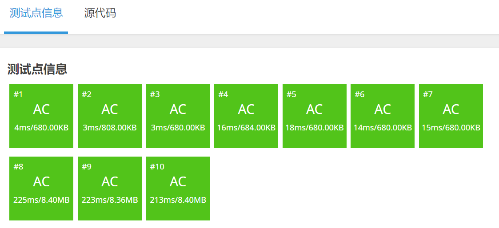

[原题链接](https://www.luogu.com.cn/problem/P3372)

#### 题目详情


#### 数据范围
- $1≤N,M≤10^5$
- 数列中任意元素的和在 $[-2^{63}, 2^{63})$内

---

## 算法与思路
> 标记的含义：本区间已经被更新过了，但是子区间却没有被更新过，被更新的信息是什么。

#### 线段树节点 node

首先此题涉及区间修改，我们需要加入**懒标记**记为 $add$，表示当前节点区间已经加上了 $add$，但是子树未被更新。

其次，我们还需要一个数 $sum$ 来表示当前区间和。因此节点node即为：
```cpp
typedef long long LL;

struct node {
    int l, r;
    LL sum, add;
} tr[N << 2];
```

---

#### pushup操作
首先 $pushup$ 操作是向上传递，我们并不需要把懒标记传给祖宗节点。所以只需要维护 $sum$ 即可。

$$root.sum=left.sum+right.sum;$$

`pushup`函数：
```cpp
void pushup(int u) {
    tr[u].sum = tr[u << 1].sum + tr[u << 1 | 1].sum;
}
```

---

#### pushdown操作
显然，父区间是包含子区间的，也就是对于父区间的标记和子区间是有联系的。在大多数情况下，父区间和子区间的标记是 **相同的** 。因此，我们可以由父区间的标记推算出子区间应当是什么标记。

在每次修改和查询操作时，我们需要将当前节点的懒标记清空并传递给子节点。

对于子节点，$add$ 只需加上父节点的 $add$，而 $sum$ 是需要区间内每个数都加上 $add$，因此转移方程为：

$$son.add+=root.add;$$

$$son.sum+=(son.r-son.l+1)*root.add;$$

`pushdown`函数：
```cpp
void pushdown(int u) {
	auto &root = tr[u];
	auto &left = tr[u << 1];
	auto &right = tr[u << 1 | 1];
	if (root.add) {
		left.add += root.add;
		left.sum += 1ll * (left.r - left.l + 1) * root.add;
		right.add += root.add;
		right.sum += 1ll * (right.r - right.l + 1) * root.add;
		root.add = 0;   // 清空lazy tag
	}
}
```

---

#### 建树操作
建树时，叶子节点的 $sum$ 即为当前数列中的数，懒标记 $add$ 初始为 $0$。

注意：祖宗节点每次建立完左右子树后，需要 $pushup$ 操作一次，修改当前节点的值。

`build`函数：
```cpp
void build(int u, int l, int r) {
	if (l == r) tr[u] = {l, r, w[r], 0};
	else {
		tr[u].l = l, tr[u].r = r;
		int mid = l + r >> 1;
		build(u << 1, l, mid);
		build(u << 1 | 1, mid + 1, r);
		pushup(u);
	}
}
```

---

#### 修改操作
此处的修改操作主要针对与懒标记，对于目标修改区间 $[l,r]$：

- 如果当前节点区间在 $[l,r]$ 内，修改当前节点；
- 如果当前节点区间范围超过 $[l,r]$，分别递归到左右子节点修改。

**注意：**每次做递归修改之前，需要将父节点的懒标记 $pushdown$ 到左右子节点中！！！

`modify`函数：
```cpp
void modify(int u, int l, int r, int v) {
	if (tr[u].l >= l && tr[u].r <= r) {
		tr[u].sum += 1ll * (tr[u].r - tr[u].l + 1) * v;
		tr[u].add += v;
	} else {
		pushdown(u);
		int mid = tr[u].l + tr[u].r >> 1;
		if (l <= mid) modify(u << 1, l, r, v);
		if (r > mid) modify(u << 1 | 1, l, r, v);
		pushup(u);
	}
}
```

---

#### 查询操作
对于每次查询，我们依旧需要把懒标记下传，防止最终答案是更新之前的值。

同样，对于目标查询区间 $[l,r]$：

- 当前节点区间在查询区间内，返回 $root.sum$；
- 当前节点区间大于查询区间，返回 $left.sum+right.sum$。

**注意：**每次做递归修改之前，需要将父节点的懒标记 $pushdown$ 到左右子节点中！！！

`query`函数：
```cpp
LL query(int u, int l, int r) {
    // 1. 在目标区间内
    // l--------------r
    //      Tl----Tr
	if (tr[u].l >= l && tr[u].r <= r) return tr[u].sum; 

	pushdown(u);
	int mid = tr[u].l + tr[u].r >> 1;
	LL sum = 0;
    // 2. 在目标区间外
    //  l-----r
    // Tl---m---Tr
	if (l <= mid) sum = query(u << 1, l, r);
	if (r > mid) sum += query(u << 1 | 1, l, r);
	return sum;
}
```

---

## 代码(无注释)
```cpp
#include <bits/stdc++.h>
using namespace std;

typedef long long LL;

const int N = 100010;

int n, m;
LL w[N];
struct node {
	int l, r;
	LL sum, add;
} tr[N << 2];

void pushup(int u) {
	tr[u].sum = tr[u << 1].sum + tr[u << 1 | 1].sum;
}

void pushdown(int u) {
	auto &root = tr[u];
	auto &left = tr[u << 1];
	auto &right = tr[u << 1 | 1];

	if (root.add) {
		left.add += root.add;
		left.sum += 1ll * (left.r - left.l + 1) * root.add;
		right.add += root.add;
		right.sum += 1ll * (right.r - right.l + 1) * root.add;
		root.add = 0;
	}
}

void build(int u, int l, int r) {
	if (l == r) tr[u] = {l, r, w[r], 0};
	else {
		tr[u].l = l, tr[u].r = r;
		int mid = l + r >> 1;
		build(u << 1, l, mid);
		build(u << 1 | 1, mid + 1, r);
		pushup(u);
	}
}

void modify(int u, int l, int r, LL v) {
	if (tr[u].l >= l && tr[u].r <= r) {
		tr[u].add += v;
		tr[u].sum += 1ll * (tr[u].r - tr[u].l + 1) * v;
	} else {
		pushdown(u);
		int mid = tr[u].l + tr[u].r >> 1;
		if (l <= mid) modify(u << 1, l, r, v);
		if (r > mid) modify(u << 1 | 1, l, r, v);
		pushup(u);
	}
}

LL query(int u, int l, int r) {
	if (tr[u].l >= l && tr[u].r <= r) return tr[u].sum;

	pushdown(u);
	int mid = tr[u].l + tr[u].r >> 1;
	LL sum = 0;
	if (l <= mid) sum = query(u << 1, l, r);
	if (r > mid) sum += query(u << 1 | 1, l, r);
	return sum;
}

int main() {
	cin >> n >> m;
	for (int i = 1; i <= n; i++) cin >> w[i];

	build(1, 1, n);

	int op, l, r;
	while (m--) {
		cin >> op >> l >> r;
		if (op == 1) {
			LL x; cin >> x;
			modify(1, l, r, x);
		} else cout << query(1, l, r) << endl;
	}

	return 0;
}
```

#### 运行结果
