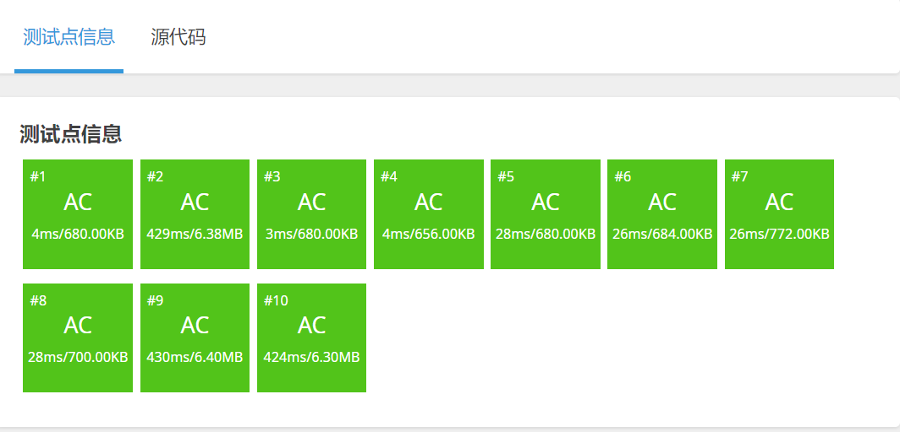

[原题链接](https://www.luogu.com.cn/problem/P3373)

#### 题目详情


#### 数据范围
- $n,m \le 10^5$

---

## 算法与思路

#### 线段树节点 $node$
首先我们需要一个 $sum$ 来存储当前节点区间的元素和。

另外根据题目要求，需要两个懒标记分别表示加数 $add$ 和乘数 $mul$。
```cpp
struct node {
	int l, r;
	int sum, add, mul;
} tr[N << 2];
```

---

#### 建树操作
对于叶子节点，当前的 $sum$ 即为数列中对应位置的点。

而祖宗节点的 $sum$ 可以由子节点 `pushup` 得出。

`build`函数：
```cpp
void build(int u, int l, int r) {
	if (l == r) tr[u] = {l, r, w[r], 0, 1};
	else {
		tr[u] = {l, r, 0, 0, 1};
		int mid = l + r >> 1;
		build(u << 1, l, mid);
		build(u << 1 | 1, mid + 1, r);
		pushup(u);
	}
}
```

---

#### pushup操作
根据线段树节点信息，可以得出：

父节点的区间和等于左子节点的区间和+右子节点的区间和。

`pushup`函数：
```cpp
void pushup(int u) {
	tr[u].sum = (tr[u << 1].sum + tr[u << 1 | 1].sum) % p;
}
```

---

#### pushdown操作
我们每次 `pushdown` 需要把懒标记向下分裂。

对于 $x$

1. 若对懒标记的处理是先加再乘，即 $(x+add)*mul$

    - 若此次操作为乘上一个数 $c$

        可以表示为 $(x+add)*mul*c$ 即 $(n+X)*X$ 的形式

    - 若此次操作为加上一个数 $c$

        $(x+add)*mul+c$ 不能写成 $(n+X)*X$ 的形式

    > *无法更新新的懒标记*

2. 若对懒标记的处理是先乘再加，即 $x*mul+add$

    - 若此次操作是加上一个数 $c$

        可以表示为 $x*mul+add+c$

        **此时新的 $add$ 即为 $add + c$**

    - 若此次操作是乘上一个数 $c$

        可以表示为 $(n*mul+add)*c$

        展开后为 $n*mul*c+add*c$

        **此时新的 $add$ 即为 $add*c$，新的 $mul$ 即为 $mul*c$**

    > *故先乘再加，以便更新懒标记*

3. 可以把乘和加的操作都看成 $x*c+d$

    - 若是乘法，$d$ 为 $0$
    - 若是加法，$c$ 为 $1$

4. 若当前 $x$ 的懒标记为 $add$ 和 $mul$

    - 操作可以写成 $(x * mul + add) * c + d$
    - 即 $x * (mul * c) + (add * c + d)$
    - 新的 $mul$ 为 $(mul * c)$，新的 $add$ 为 $(add * c + d)$

**注意**：乘的懒标记初始为 $1$

同时，可以发现，我们需要进行重复很多次的修改懒标记的操作。因此我们可以将这些操作写成一个函数`cal`，便于每次使用。

`pushdown`完成后，记得清空当前节点的懒标记。

`pushdown`函数 和 `cal`函数：
```cpp
void cal(node &t, int add, int mul) {
	t.sum = (1ll * t.sum * mul + 1ll * (t.r - t.l + 1) * add) % p;
	t.add = (1ll * t.add * mul + add) % p;
	t.mul = 1ll * t.mul * mul % p;
}

void pushdown(int u) {
	cal(tr[u << 1], tr[u].add, tr[u].mul);      // 下传左子树
	cal(tr[u << 1 | 1], tr[u].add, tr[u].mul);  // 下传右子树
	tr[u].add = 0;
	tr[u].mul = 1;
}
```

---

#### modify操作
1. 如果当前区间在查询区间内，直接更新当前节点；
2. 反之，递归修改前先把懒标记下传，然后分别修改左子树和右子树，最后 `pushup` 维护父节点

`modify`函数：
```cpp
void modify(int u, int l, int r, int add, int mul) {
	if (tr[u].l >= l && tr[u].r <= r) cal(tr[u], add, mul); // 修改当前区间
	else {
		pushdown(u);
		int mid = tr[u].l + tr[u].r >> 1;
		if (l <= mid) modify(u << 1, l, r, add, mul);       // 递归左子树
		if (r > mid) modify(u << 1 | 1, l, r, add, mul);    // 递归右子树
		pushup(u);
	}
}
```

---

#### query操作
对于每次查询，我们依旧需要把懒标记下传，防止最终答案是更新之前的值。

同样，对于目标查询区间 $[l,r]$：

- 当前节点区间在查询区间内，返回 $root.sum$；
- 当前节点区间大于查询区间，返回 $left.sum+right.sum$。

**注意：**每次做递归修改之前，需要将父节点的懒标记 $pushdown$ 到左右子节点中！！！

`query`函数：
```cpp
int query(int u, int l, int r) {
    // 1. 在目标区间内
    // l--------------r
    //      Tl----Tr
	if (tr[u].l >= l && tr[u].r <= r) return tr[u].sum;

	pushdown(u);
	int mid = tr[u].l + tr[u].r >> 1;
	int sum = 0;

    // 2. 在目标区间外
    //  l-----r
    // Tl---m---Tr
	if (l <= mid) sum = query(u << 1, l, r);
	if (r > mid) sum = (sum + query(u << 1 | 1, l, r)) % p;
	return sum;
}
```

---

## 代码(无注释)
```cpp
#include <bits/stdc++.h>
using namespace std;

const int N = 100010;

int n, m, p;
int w[N];
struct node {
	int l, r;
	int sum, add, mul;
} tr[N << 2];

void cal(node &t, int add, int mul) {
	t.sum = (1ll * t.sum * mul + 1ll * (t.r - t.l + 1) * add) % p;
	t.add = (1ll * t.add * mul + add) % p;
	t.mul = 1ll * t.mul * mul % p;
}

void pushup(int u) {
	tr[u].sum = (tr[u << 1].sum + tr[u << 1 | 1].sum) % p;
}

void pushdown(int u) {
	cal(tr[u << 1], tr[u].add, tr[u].mul);
	cal(tr[u << 1 | 1], tr[u].add, tr[u].mul);
	tr[u].add = 0;
	tr[u].mul = 1;
}

void build(int u, int l, int r) {
	if (l == r) tr[u] = {l, r, w[r], 0, 1};
	else {
		tr[u] = {l, r, 0, 0, 1};
		int mid = l + r >> 1;
		build(u << 1, l, mid);
		build(u << 1 | 1, mid + 1, r);
		pushup(u);
	}
}

void modify(int u, int l, int r, int add, int mul) {
	if (tr[u].l >= l && tr[u].r <= r) cal(tr[u], add, mul);
	else {
		pushdown(u);
		int mid = tr[u].l + tr[u].r >> 1;
		if (l <= mid) modify(u << 1, l, r, add, mul);
		if (r > mid) modify(u << 1 | 1, l, r, add, mul);
		pushup(u);
	}
}

int query(int u, int l, int r) {
	if (tr[u].l >= l && tr[u].r <= r) return tr[u].sum;

	pushdown(u);
	int mid = tr[u].l + tr[u].r >> 1;
	int sum = 0;
	if (l <= mid) sum = query(u << 1, l, r);
	if (r > mid) sum = (sum + query(u << 1 | 1, l, r)) % p;
	return sum;
}

int main() {
	cin >> n >> m >> p;
	for (int i = 1; i <= n; i++) cin >> w[i];

	build(1, 1, n);

	int op, l, r, d;
	while (m--) {
		cin >> op >> l >> r;
		if (op == 1) {
			cin >> d;
			modify(1, l, r, 0, d);
		} else if (op == 2) {
			cin >> d;
			modify(1, l, r, d, 1);
		} else cout << query(1, l, r) << '\n';
	}

	return 0;
}
```

#### 运行结果
