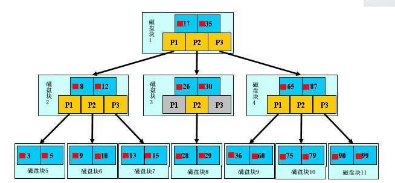
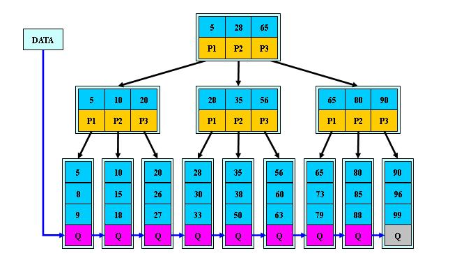
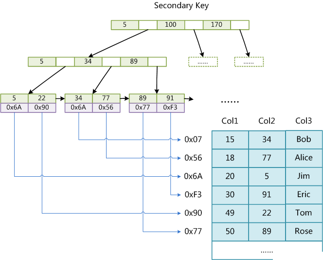
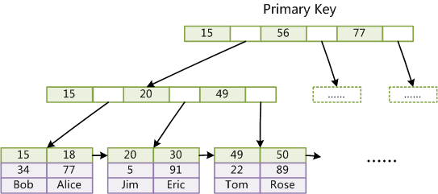

# MySQL高级

在JavaWeb阶段，我们初步认识了MySQL数据库，包括一些基本操作，比如创建数据库、表、触发器，以及最基本的增删改查、事务等操作。而在此阶段，我们将继续深入学习MySQL，了解它的更多高级玩法，也相当于进行复习。

## 函数

其实函数我们在之前已经接触到一部分了，在JavaWeb阶段，我们了解了聚集函数，聚集函数一般用作统计，包括：

* count([distinct]*)    统计所有的行数（distinct表示去重再统计，下同）
* count([distinct]列名)    统计某列的值总和
* sum([distinct]列名)    求一列的和（注意必须是数字类型的）
* avg([distinct]列名)    求一列的平均值（注意必须是数字类型）
* max([distinct]列名)    求一列的最大值
* min([distinct]列名)    求一列的最小值

比如我们需要计算某个表一共有多少行：

```sql
SELECT COUNT(*) FROM student
```

通过使用COUNT聚集函数，就可以快速统计并得到结果，比如我们想计算某一列上所有数字的和：

```sql
SELECT SUM(sid) FROM student
```

通过SUM聚集函数，就可以快速计算每一列的和，实际上这些函数都是由系统提供的函数，我们可以直接使用。

本版块我们会详细介绍各类系统函数以及如何编写自定义函数。

### 系统函数

系统为我们提供的函数也是非常实用的，我们将会分为几个类型进行讲解。

#### 字符串函数

处理字符串是一个比较重要的内容，我们可以使用字符串函数来帮助我们快速处理字符串，其中常用比如用于字符串分割的函数有：

* substring(字符串, 起始位置, 结束位置)     同Java中String类的substring一致，但是注意下标是从1开始，下同
* left(字符串, 长度)     从最左边向右截取字符串
* right(字符串, 长度)     从最右边向左截取字符串

比如我们只想获取所有学生姓名的第二个字，那么可以像这样写：

```sql
SELECT SUBSTRING(name, 2, 2) FROM student
```

比如我们想获取所有学生姓名的第一个字，可以像这样写：

```sql
SELECT LEFT(name, 1) FROM student
```

我们还可以利用字符串函数来快速将所有的字母转换为大写字母或是快速转换为小写字母：

* upper(字符串)     字符串中的所有字母转换为大写字母
* lower(字符串)     字符串中的所有字母转换为小写字母

比如我们希望将一个字符串所有字符专为大写：

```sql
SELECT UPPER('abcdefg')
```

我们也可以像Java中那样直接对字符串中的内容进行替换：

* replace(字符串, 原文, 替换文)      同Java中String的replace效果

比如现在我们希望将查询到的所有同学的名称中的`小`全部替换`大`：

```sql
SELECT REPLACE(`name`, '小', '大') FROM student
```

字符串也支持进行拼接，系统提供了字符串的拼接函数：

* concat(字符串1, 字符串2)   连接两个字符串

比如我们希望将查询到的所有同学的名称最后都添加一个`子`字：

```sql
SELECT concat(name, '子') FROM student
```

最后就是计算字符串的长度：

* length(字符串)    获取字符串长度（注意如果使用的是UTF-8编码格式，那么一个汉字占3字节，数字和字母占一个字节）

比如我们要获取所有人名字的长度：

```sql
SELECT LENGTH(`name`) FROM student
```

#### 日期函数

MySQL提供的日期函数也非常实用，我们可以快速对日期进行操作，比如我们想要快速将日期添加N天，就可以使用：

* date_add(日期, interval 增量 单位)

比如我们希望让2022-1-1向后5天：

```sql
SELECT DATE_ADD('2022-1-1',INTERVAL 5 day)
```

同理，向前1年：

```sql
SELECT DATE_ADD('2022-1-1',INTERVAL -1 year)
```

单位有：year（年）、month（月）、day（日）、hour（小时）、minute（分钟）、second（秒）

我们还可以快速计算日期的间隔天数：

* datediff(日期1, 日期2)

比如我们想计算2022年的2月有多少天：

```sql
SELECT DATEDIFF('2022-3-1','2022-2-1')
```

如果我们想快速获取当前时间的话，可以使用这些：

* curdate()     当前的日期
* curtime()     当前的时间
* now()    当前的日期+时间

此函数之前我们在编写实战项目的时候已经使用过了，这里就不演示了。我们也可以单独获取时间中的某个值：

* day(日期)    获取日期是几号
* month(日期)   获取日期是几月
* year(日期)      获取日期是哪一年

比如我们想获取今天是几号：

```sql
SELECT DAY(NOW())
```

#### 数学函数

数学函数比较常规，基本与Java的Math工具类一致，这里列出即可，各位可以自行尝试：

* abs(x)   求x的绝对值
* ceiling(x)   x向上取整
* floor(x)  x向下取整
* round(x, 精度)  x取四舍五入，遵循小数点精度 
* exp(x)   e的x次方
* rand()   0-1之间的随机数
* log(x)    x的对数
* pi()     π
* power(x, n)    x的n次方
* sqrt(x)     x的平方根
* sin(x)  cos(x)   tan(x)     三角函数（貌似没有arctan这类反函数？）

#### 类型转换函数

MySQL的类型转换也分为隐式类型转换和显示类型转换，首先我们来看看隐式类型转换：

```sql
SELECT 1+'2'
```

虽然这句中既包含了数字和字符，但是字符串会被进行隐式转换（注意这里并不是按照字符的ASCII码转换，而是写的多少表示多少）所以最后得到的就是1+2的结果为3

```sql
SELECT CONCAT(1, '2')
```

这里因为需要传入字符串类型的数据，但是我们给的是1这个数字，因此这里也会发生隐式类型转换，1会被直接转换为字符串的'1'，所以这里得到的结果是'12'

在某些情况下，我们可能需要使用强制类型转换来将得到的数据转换成我们需要的数据类型，这时就需要用到类型转换函数了，MySQL提供了：

* cast(数据   as 数据类型)

数据类型有以下几种：

* BINARY[(N)] ：二进制字符串，转换后长度小于N个字节
* CHAR[(N)] ：字符串，转换后长度小于N个字符
* DATE ：日期
* DATETIME ：日期时间
* DECIMAL[(M[,N])] ：浮点数，M为数字总位数(包括整数部分和小数部分)，N为小数点后的位数
* SIGNED [INTEGER] ：有符号整数
* TIME ：时间
* UNSIGNED [INTEGER] ：无符号整数

比如我们现在需要将一个浮点数转换为一个整数：

```sql
SELECT CAST(pi() AS SIGNED)
```

我们还可以将字符串转换为数字，会自动进行扫描，值得注意的是一旦遇到非数字的字符，会停止扫描：

```sql
SELECT CAST('123abc456' as SIGNED)
```

除了cast以外还有convert函数，功能比较相似，这里就不做讲解了。

#### 流程控制函数

MySQL还为我们提供了很多的逻辑判断函数，比如：

* if(条件表达式, 结果1, 结果2)    与Java中的三目运算符一致 a > b ? "AAA" : "BBB"
* ifnull(值1, 值2)     如果值1为NULL则返回值2，否则返回值1
* nullif(值1, 值2)     如果值1与值2相等，那么返回NULL
* isnull(值)      判断值是否为NULL

比如现在我们想判断：

```sql
SELECT IF(1 < 0,'lbwnb','yyds')
```

通过判断函数，我们就可以很方便地进行一些条件判断操作。

除了IF条件判断，我们还可以使用类似Switch一样的语句完成多分支结构：

```sql
SELECT 
CASE 2
	WHEN 1 THEN
		10
	ELSE
		5
END;
```

我们也可以将自定义的判断条件放入When之后，它类似于else-if：

```sql
SELECT 
CASE
	WHEN 3>5 THEN
		10
	WHEN 0<1 THEN
		11
	ELSE
		5
END;
```

还有一个类似于Java中的Thread.sleep的函数，以秒为单位：

```sql
SELECT sleep(10);
```

有关MySQL8.0新增的窗口函数这里暂时不做介绍。

### 自定义函数

除了使用系统为我们提供的函数以外，我们也可以自定义函数，并使用我们自定义的函数进行数据处理，唯一比较麻烦的就是函数定义后不能修改，只能删了重新写。

#### 基本语法

MySQL的函数与Java中的方法类似，也可以添加参数和返回值，可以通过`CREATE FUNCTION`创建函数：

```sql
CREATE FUNCTION test() RETURNS INT
BEGIN
RETURN 666;
END
```

定义函数的格式为：

* create function 函数名称([参数列表]) returns 返回值类型
* begin 和 end 之间写函数的其他逻辑，begin和end就相当于Java中的花括号`{  ...  }`
* return后紧跟返回的结果

添加参数也很简单，我们只需要在函数名称括号中添加即可，注意类型需要写在参数名称后面：

```sql
CREATE FUNCTION test(i INT) RETURNS INT
BEGIN
RETURN i * i;
END
```

我们可以在BEGIN和RETURN之间编写一些其他的逻辑，比如我们想要定义一个局部变量，并为其赋值：

```sql
BEGIN
DECLARE a INT;
SET a = 10;
RETURN i * i * a;
END
```

定义局部变量的格式为：

* declare 变量名称 变量类型 [, ...]
* declare 变量名称 变量类型 default 默认值

为变量赋值的格式为：

* set 变量名称 = 值

我们还可以在函数内部使用`select`语句，它可以直接从表中读取数据，并可以结合into关键字将查询结果赋值给变量：

```sql
BEGIN
DECLARE a INT;
-- select into from 语句
SELECT COUNT(*) INTO a FROM student;
RETURN a;
END
```

#### 流程控制

接着我们来看一下如何使用流程控制语句，其中最关键的就是IF判断语句：

```sql
BEGIN
DECLARE a INT DEFAULT 10;
IF a > 10 THEN
	RETURN 1;
ELSE
	RETURN 2;
END IF;
END
```

IF分支语句的格式为：

* if 判断条件 then  ... else if 判断条件 then .... else ... end if;

我们可以结合`exists`关键字来判断是否为NULL：

```sql
BEGIN
DECLARE a INT DEFAULT 0;
-- IF EXISTS(SELECT * FROM student WHERE sid = 100) THEN
IF NOT EXISTS(SELECT * FROM student WHERE sid = 100) THEN
	SET a = 10;
END IF;
RETURN a;
END
```

我们也可以在函数中使用switch语句：

```sql
BEGIN
DECLARE a INT DEFAULT 10;
CASE a
	WHEN 10 THEN
		RETURN 2;
	ELSE
		RETURN 1;
END CASE;
END
```

SWITCH分支语句的格式为：

* case 变量 when 具体值或是布尔表达式 then ... when * then ... else ... end case;

与Java不同的是，它支持使用布尔表达式：

```sql
BEGIN
DECLARE a INT DEFAULT 10;
CASE
	WHEN 1 < 5 THEN
		SET a = 5;
	ELSE
		SET a = 10;
END CASE;
RETURN a;
END
```

我们以类似于elseif的形式进行判断，其实和上面直接使用是一样的。

我们接着来看循环语句，MySQL提供了三种循环语句，其中第一种是WHILE语句：

```sql
BEGIN
DECLARE a INT DEFAULT 10;
WHILE a < 11 DO
	SET a = a + 1;
END WHILE;
RETURN a;
END
```

格式为：

* while 循环条件 do ...  end while;

我们接着来看第二种循环语句，LOOP循环：

```sql
BEGIN
DECLARE a INT DEFAULT 10;
lp1: LOOP
  SET a = a - 1;
	IF a = 0 THEN
		LEAVE lp1; 
	END IF; 
END LOOP lp1;
RETURN a;
END
```

相比while语句，我们可以使用`LEAVE`精准控制结束哪个循环，有点类似于goto语句：

```sql
BEGIN
DECLARE a INT DEFAULT 0;
lp1: LOOP
  lp2: LOOP
	SET a = a + 1;
	IF a > 5 THEN
		LEAVE lp1; 
	END IF; 
	END LOOP lp2;
END LOOP lp1;
RETURN a;
END
```

类似于Java中的goto写法（在JavaSE阶段已经讲解过）：

```java
public static void main(String[] args) {
    int a = 0;
    lp1: while (true){
        lp2: while (true){
            a++;
            if(a > 5) break lp1;
        }
    }
    System.out.println(a);
}
```

它的语法格式如下：

* 循环名称 loop ...(可以插入leave语句结束) end loop 循环名称;

接着我们来看最后一种循环语句，repeat语句：

```sql
BEGIN
DECLARE a INT DEFAULT 0;
REPEAT
	SET a = a + 1;
UNTIL a > 0 END REPEAT;
RETURN a;
END
```

它类似于Java中的do-while循环语句，它会先去执行里面的内容，再进行判断，格式为：

* repeat ... until 结束循环条件 end repeat;

#### 全局变量

某些情况下，我们可以直接在一次会话中直接定义变量并使用，这时它并不是位于函数内的，这就是全局变量，它无需预先定义，直接使用即可：

```sql
set @x = 10;
```

我们可以将全局变量作为参数传递给函数：

```sql
select test(@x);
```

除了我们自己定义的全部变量以外，系统默认也有很多的变量，因此我们自己定义的变量称为用户变量，系统默认变量称为系统变量。查看系统变量的命令为：

```sql
show GLOBAL VARIABLES
```

***

## 存储过程

存储过程是一个包括多条SQL语句的集合，专用于特定表的特定操作，比如我们之前实战项目中的创建用户，那么我们就需要一次性为两张表添加数据，但是如果不使用Java，而是每次都去使用SQL命令来完成，就需要手动敲两次命令，非常麻烦，因此我们可以提前将这些操作定义好，预留出需要填写数据的位置，下次输入参数直接调用即可。

这里很容易与函数搞混淆，存储过程也是执行多条SQL语句，但是它们的出发点不一样，函数是专用于进行数据处理，并将结果返回给调用者，它更多情况下是一条SQL语句的参与者，无法直接运行，并且不涉及某个特定表：

```sql
select count(*) from student;
```

而存储过程是多条SQL语句的执行者，这是它们的本质区别。

定义存储过程与定义函数极为相似，它也可以包含参数，函数中使用的语句这里也能使用，但是它没有返回值：

```sql
CREATE PROCEDURE lbwnb(`name` VARCHAR(20), pwd VARCHAR(255))
BEGIN
  INSERT INTO users(username, `password`) VALUES(`name`, pwd);
END
```

我们可以在存储过程中编写多条SQL语句，但是注意，MySQL的存储过程不具有原子性，当出现错误时，并不会回滚之前的操作，因此需要我们自己来编写事务保证原子性。

接着我们来看看如何执行存储过程：

```sql
CALL lbwnb('111', '2222')
```

通过使用`call`来执行一个存储过程，如果存储过程有参数，那么还需要填写参数。

比如现在我们想要实现查询用户表，如果包含用户`test`那么就删除用户，如果不包含，就添加用户：

```sql
CREATE PROCEDURE `lbwnb`()
BEGIN
	IF NOT EXISTS(SELECT * FROM users WHERE username = 'test') THEN
		INSERT INTO users(username, `password`) VALUES('test', '123456');
	ELSE
		DELETE FROM users WHERE username = 'test';
	END IF;
END
```

这里其实只需要一个简单的IF判断即可实现。

那么如果我们希望遍历一个SELECT语句查询的结果呢？我们可以使用游标来完成：

```sql
BEGIN
	DECLARE id INT;
	DECLARE `name` VARCHAR(10);
	DECLARE sex VARCHAR(5);
	DECLARE cur CURSOR FOR SELECT * FROM student;
	OPEN cur;
	WHILE TRUE DO
		FETCH cur INTO id, `name`, sex;
		SELECT id, `name`, sex;
	END WHILE;
	CLOSE cur;
END
```

游标的使用分为4个步骤：

* DECLARE 游标名称 CURSOR FOR 查询结果   -  定义游标
* OPEN cur     -   开启游标
* FETCH 游标名称 INTO 存储结果的变量    -    从顶部开始，每执行一次，向下移动，如果已经在最底部，则触发异常
* CLOSE cur    -   关闭游标

我们这里利用了一个while循环来多次通过游标获取查询结果，但是最后是因为出现异常才退出的，这样会导致之后的代码就无法继续正常运行了。

我们接着来看如何处理异常：

```sql
BEGIN
	DECLARE id INT;
	DECLARE `name` VARCHAR(10);
	DECLARE sex VARCHAR(5);
	DECLARE score INT;
	DECLARE a INT DEFAULT 0;
	DECLARE cur CURSOR FOR SELECT * FROM student;
	-- 必须在游标定义之后编写
	DECLARE CONTINUE HANDLER FOR 1329 SET a = 1;
	OPEN cur;
	WHILE a = 0 DO
		FETCH cur INTO id, `name`, sex, score;
		SELECT id, `name`, sex, score;
	END WHILE;
	CLOSE cur;
	SELECT 1;
END
```

我们可以声明一个异常处理器（句柄），格式如下：

* declear (continue/exit) handler for 异常名称(ID) 做点什么

我们还可以限定存储过程的参数传递，比如我们只希望用户给我们一个参数用于接收数据，而不是值传递，我们可以将其设定为OUT类型：

```sql
CREATE PROCEDURE `lbwnb`(OUT a INT)
BEGIN
	SELECT a;
	SET a = 100;
END
```

所有的参数默认为`IN`类型，也就是只能作为传入参数，无法为其赋值，而这里讲参数设定为`OUT`类型，那么参数无法将值传入，而只能被赋值。

如果我们既希望参数可以传入也可以被重新赋值，我们可以将其修改为`INOUT`类型。

***

## 存储引擎

存储引擎就像我们电脑中的CPU，它是整个MySQL最核心的部分，数据库中的数据如何存储，数据库能够支持哪些功能，我们的增删改查请求如何执行，都是由存储引擎来决定的。

我们可以大致了解一下以下三种存储引擎：

* **MyISAM：**MySQL5.5之前的默认存储引擎，在插入和查询的情况下性能很高，但是它不支持事务，只能添加表级锁。
* **InnoDB：**MySQL5.5之后的默认存储引擎，它支持ACID事务、行级锁、外键，但是性能比不过MyISAM，更加消耗资源。
* **Memory：**数据都存放在内存中，数据库重启或发生崩溃，表中的数据都将消失。

我们可以使用下面的命令来查看MySQL支持的存储引擎：

```sql
show engines;
```

在创建表时，我们也可以为表指定其存储引擎。

我们还可以在配置文件中修改默认的存储引擎，在Windows 11系统下，MySQL的配置文件默认放在`C:\ProgramData\MySQL\MySQL Server 5.7`中，注意ProgramData是个隐藏文件夹。

***

## 索引

**注意：**本小节会涉及`数据结构与算法`相关知识。

索引就好像我们书的目录，每本书都有一个目录用于我们快速定位我们想要的内容在哪一页，索引也是，通过建立索引，我们就可以根据索引来快速找到想要的一条记录，大大提高查询效率。

本版块我们会详细介绍索引的几种类型，以及索引的底层存储原理。

### 单列索引

单列索引只针对于某一列数据创建索引，单列索引有以下几种类型：

* **NORMAL：**普通的索引类型，完完全全相当于一本书的目录。
* **UNIQUE：**唯一索引，我们之前已经用过了，一旦建立唯一索引，那么整个列中将不允许出现重复数据。每个表的主键列，都有一个特殊的唯一索引，叫做Primary Key，它不仅仅要求不允许出现重复，还要求不能为NULL，它还可以自动递增。每张表可以有多个唯一索引，但是只能有一个Primary索引。
* **SPATIAL：**空间索引，空间索引是对空间数据类型的字段建立的索引，MYSQL中的空间数据类型有4种，分别是GEOMETRY、POINT、LINESTRING、POLYGON，不是很常用，这里不做介绍。
* **FULLTEXT：**全文索引（MySQL 5.6 之后InnoDB才支持），它是模糊匹配的一种更好的解决方案，它的效率要比使用`like %`更高，并且它还支持多种匹配方式，灵活性也更加强大。只有字段的数据类型为 char、varchar、text 及其系列才可以建全文索引。

我们来看看如何使用全文索引，首先创建一张用于测试全文索引的表：

```sql
CREATE TABLE articles (
  id INT UNSIGNED AUTO_INCREMENT NOT NULL PRIMARY KEY,
  title VARCHAR(200),
  body TEXT,
  FULLTEXT (body));
```

```sql
INSERT INTO articles VALUES
	(NULL,'MySQL Tutorial', 'DBMS stands for DataBase ...'),
	(NULL,'How To Use MySQL Efficiently', 'After you went through a ...'),
	(NULL,'Optimising MySQL','In this tutorial we will show ...'),
	(NULL,'1001 MySQL Tricks','1. Never run mysqld as root. 2. ...'),
	(NULL,'MySQL vs. YourSQL', 'In the following database comparison ...'),
	(NULL,'MySQL Security', 'When configured properly, MySQL ...');
```

最后我们使用全文索引进行模糊匹配：

```sql
SELECT * FROM articles WHERE MATCH (body) AGAINST ('database');
```

注意全文索引如何定义字段的，match中就必须是哪些字段，against中定义需要模糊匹配的字符串，我们用作查找的字符串实际上是被分词之后的结果，如果进行模糊匹配的不是一个词语，那么会查找失败，但是它的效率远高于以下这种写法：

```sql
SELECT * FROM articles WHERE body like '%database%';
```

### 组合索引

组合索引实际上就是将多行捆绑在一起，作为一个索引，它同样支持以上几种索引类型，我们可以在Navicat中进行演示。

注意组合索引在进行匹配时，遵循最左原则。

我们可以使用`explain`语句（它可以用于分析select语句的执行计划，也就是MySQL到底是如何在执行某条select语句的）来分析查询语句到底有没有通过索引进行匹配。

```sql
explain select * from student where name = '小王';
```

得到的结果如下：

* select_type：查询类型，上面的就是简单查询（SIMPLE）
* table：查询的表
* type：MySQL决定如何查找对应的记录，效率从高到低：system > const > eq_ref > ref > range > index > all
* possible_keys：执行查询时可能会用到的索引
* key：实际使用的索引
* key_len：Mysql在索引里使用的字节数，字段的最大可能长度
* rows：扫描的行数
* extra：附加说明

### 索引底层原理

在了解完了索引的类型之后，我们接着来看看索引是如何实现的。

既然我们要通过索引来快速查找内容，那么如何设计索引就是我们的重点内容，因为索引是存储在硬盘上的，跟我们之前使用的HashMap之类的不同，它们都是在内存中的，但是硬盘的读取速度远小于内存的速度，每一次IO操作都会耗费大量的时间，我们也不可能把整个磁盘上的索引全部导入内存，因此我们需要考虑尽可能多的减少IO次数，索引的实现可以依靠两种数据结构，一种是我们在JavaSE阶段已经学习过的Hash表，还有一种就是B-Tree。

我们首先来看看哈希表，实际上就是计算Hash值来快速定位：


通过对Key进行散列值计算，我们可以直接得到对应数据的存放位置，它的查询效率能够达到O(1)，但是它也存在一定的缺陷：

* Hash索引仅仅能满足“=”，“in”查询条件，不能使用范围查询。 
* Hash碰撞问题。
* 不能用部分索引键来搜索，因为组合索引在计算哈希值的时候是一起计算的。

那么，既然要解决这些问题，我们还有一种方案就是使用类似于二叉树那样的数据结构来存储索引，但是这样相比使用Hash索引，会牺牲一定的读取速度。

但是这里并没有使用二叉树，而是使用了BTree，它是专门为磁盘数据读取设计的一种度为n的查找树：

* 树中每个结点最多含有m个孩子（m >= 2）
* 除根结点和叶子结点外，其它每个结点至少有[ceil(m / 2)]个孩子。
* 若根结点不是叶子结点，则至少有2个孩子。
* 所有叶子结点都出现在同一层。
* 每个非终端结点中包含有n个键值信息： (P1，K1，P2，K2，P3，......，Kn，Pn+1)。其中： 
         
  1. Ki (i=1...n)为键值，且键值按顺序升序排序K(i-1)< Ki。  
  2. Pi为指向子树根的结点，且指针P(i)指向的子树中所有结点的键值均小于Ki，但都大于K(i-1)。  
  3. 键值的个数n必须满足： [ceil(m / 2)-1] <= n <= m-1。



比如现在我们要对键值为**10**的记录进行查找，过程如下：

1. 读取根节点数据（目前进行了一次IO操作）
2. 根据根节点数据进行判断得到10<17，因为P1指向的子树中所有值都是小于17的，所以这时我们将P1指向的节点读取（目前进行了两次IO操作）
3. 再次进行判断，得到8<10<12，因为P2指向的子树中所有的值都是小于12大于8的，所以这时读取P2指向的节点（目前进行了三次IO操作）
4. 成功找到。

我们接着来看，虽然BTree能够很好地利用二叉查找树的思想大幅度减少查找次数，但是它的查找效率还是很低，因此它的优化版本B+Tree诞生了，它拥有更稳定的查询效率和更低的IO读取次数：



我们可以发现，它和BTree有一定的区别：

* 有n棵子树的结点中含有n个键值，BTree只有n-1个。
* 所有的键值信息只在叶子节点中包含，非叶子节点仅仅保存子节点的最小（或最大）值，和指向叶子节点的指针，这样相比BTree每一个节点在硬盘中存放了更少的内容（没有键值信息了）
* 所有叶子节点都有一个根据大小顺序指向下一个叶子节点的指针Q，本质上数据就是一个链表。

这样，读取IO的时间相比BTree就减少了很多，并且查询任何键值信息都需要完整地走到叶子节点，保证了查询的IO读取次数一致。因此MySQL默认选择B+Tree作为索引的存储数据结构。

这是MyISAM存储引擎下的B+Tree实现：



这是InnoDB存储引擎下的B+Tree实现：




InnoDB与MyISAM实现的不同之处：

* 数据本身就是索引的一部分（所以这里建议主键使用自增）
* 非主键索引的数据实际上存储的是对应记录的主键值（因此InnoDB必须有主键，若没有也会自动查找替代）

***

## 锁机制

在JavaSE的学习中，我们在多线程板块首次用到了锁机制，当我们对某个方法或是某个代码块加锁后，除非锁的持有者释放当前的锁，否则其他线程无法进入此方法或是代码块，我们可以利用锁机制来保证多线程之间的安全性。

在MySQL中，就很容易出现多线程同时操作表中数据的情况，如果要避免潜在的并发问题，那么我们可以使用之前讲解的事务隔离级别来处理，而事务隔离中利用了锁机制。

- 读未提交(Read Uncommitted)：能够读取到其他事务中未提交的内容，存在脏读问题。
- 读已提交(Read Committed RC)：只能读取其他事务已经提交的内容，存在不可重复读问题。
- 可重复读(Repeated Read RR)：在读取某行后不允许其他事务操作此行，直到事务结束，但是依然存在幻读问题。
- 串行读(Serializable)：一个事务的开始必须等待另一个事务的完成。

我们可以切换隔离级别分别演示一下：

```sql
set session transaction isolation level read uncommitted;
```

在RR级别下，MySQL在一定程度上解决了幻读问题：

* 在快照读（不加锁）读情况下，mysql通过mvcc来避免幻读。
* 在当前读（加锁）读情况下，mysql通过next-key来避免幻读。

> **`MVCC`**，全称 `Multi-Version Concurrency Control` ，即多版本并发控制。MVCC 是一种并发控制的方法，一般在数据库管理系统中，实现对数据库的并发访问，在编程语言中实现事务内存。

### 读锁和写锁

从对数据的操作类型上来说，锁分为读锁和写锁：

* **读锁：**也叫共享锁，当一个事务添加了读锁后，其他的事务也可以添加读锁或是读取数据，但是不能进行写操作，只能等到所有的读锁全部释放。
* **写锁：**也叫排他锁，当一个事务添加了写锁后，其他事务不能读不能写也不能添加任何锁，只能等待当前事务释放锁。

### 全局锁、表锁和行锁

从锁的作用范围上划分，分为全局锁、表锁和行锁：

* **全局锁：**锁作用于全局，整个数据库的所有操作全部受到锁限制。
* **表锁：**锁作用于整个表，所有对表的操作都会收到锁限制。
* **行锁：**锁作用于表中的某一行，只会通过锁限制对某一行的操作（仅InnoDB支持）

#### 全局锁

我们首先来看全局锁，它作用于整个数据库，我们可以使用以下命令来开启读全局锁：

```sql
flush tables with read lock;
```

开启后，整个数据库被上读锁，我们只能去读取数据，但是不允许进行写操作（包括更新、插入、删除等）一旦执行写操作，会被阻塞，直到锁被释放，我们可以使用以下命令来解锁：

```sql
unlock tables;
```

除了手动释放锁之外，当我们的会话结束后，锁也会被自动释放。

#### 表锁

表锁作用于某一张表，也是MyISAM和InnoDB存储引擎支持的方式，我们可以使用以下命令来为表添加锁：

```sql
lock table 表名称 read/write;
```

在我们为表添加写锁后，我们发现其他地方是无法访问此表的，一律都被阻塞。

#### 行锁

表锁的作用范围太广了，如果我们仅仅只是对某一行进行操作，那么大可不必对整个表进行加锁，因此`InnoDB`支持了行锁，我们可以使用以下命令来对某一行进行加锁：

```sql
-- 添加读锁（共享锁）
select * from ... lock in share mode;
-- 添加写锁（排他锁）
select * from ... for update;
```

使用InnoDB的情况下，在执行更新、删除、插入操作时，数据库也会自动为所涉及的行添加写锁（排他锁），直到事务提交时，才会释放锁，执行普通的查询操作时，不会添加任何锁。使用MyISAM的情况下，在执行更新、删除、插入操作时，数据库会对涉及的表添加写锁，在执行查询操作时，数据库会对涉及的表添加读锁。

**提问：**当我们不使用id进行选择，行锁会发生什么变化？（行锁升级）

### 记录锁、间隙锁和临键锁

我们知道InnoDB支持使用行锁，但是行锁比较复杂，它可以继续分为多个类型。

#### 记录锁

（Record Locks）记录锁, 仅仅锁住索引记录的一行，在单条索引记录上加锁。Record lock锁住的永远是索引，而非记录本身，即使该表上没有任何索引，那么innodb会在后台创建一个隐藏的聚集主键索引，那么锁住的就是这个隐藏的聚集主键索引。所以说当一条sql没有走任何索引时，那么将会在每一条聚合索引后面加写锁，这个类似于表锁，但原理上和表锁应该是完全不同的。

#### 间隙锁

（Gap Locks）仅仅锁住一个索引区间（开区间，不包括双端端点）。在索引记录之间的间隙中加锁，或者是在某一条索引记录之前或者之后加锁，并不包括该索引记录本身。比如在 1、2中，间隙锁的可能值有 (-∞, 1)，(1, 2)，(2, +∞)，间隙锁可用于防止幻读，保证索引间的不会被插入数据。

#### 临键锁

（Next-Key Locks）Record lock + Gap lock，左开右闭区间。默认情况下，`InnoDB`正是使用Next-key Locks来锁定记录（如select … for update语句）它还会根据场景进行灵活变换：

| 场景                                       | 转换                           |
| :----------------------------------------- | ------------------------------ |
| 使用唯一索引进行精确匹配，但表中不存在记录 | 自动转换为 Gap Locks           |
| 使用唯一索引进行精确匹配，且表中存在记录   | 自动转换为 Record Locks        |
| 使用非唯一索引进行精确匹配                 | 不转换                         |
| 使用唯一索引进行范围匹配                   | 不转换，但是只锁上界，不锁下界 |

https://zhuanlan.zhihu.com/p/48269420
