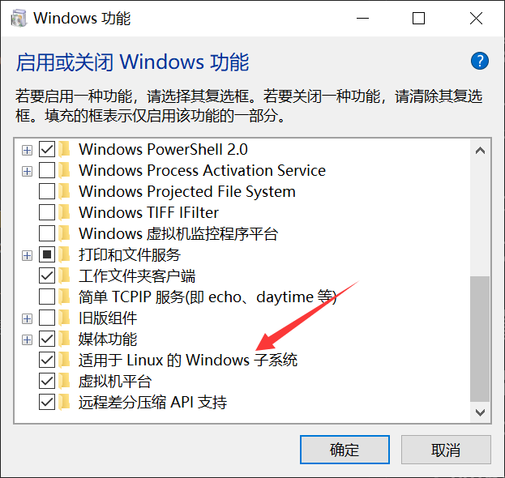
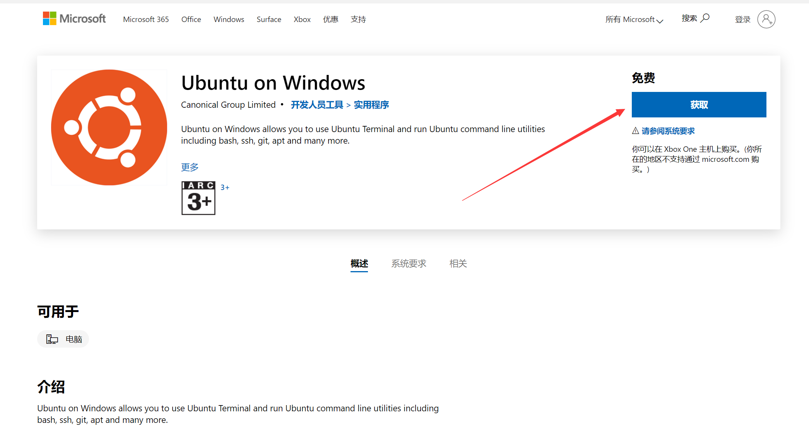
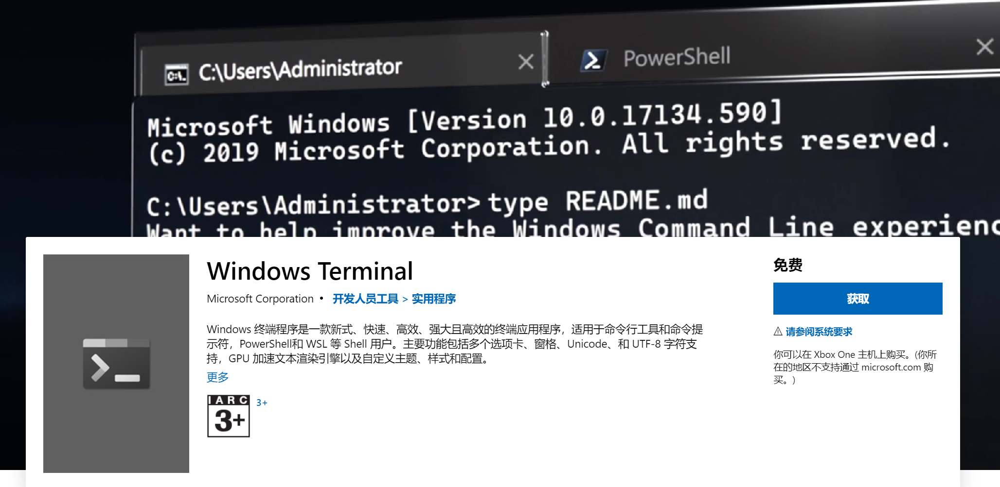
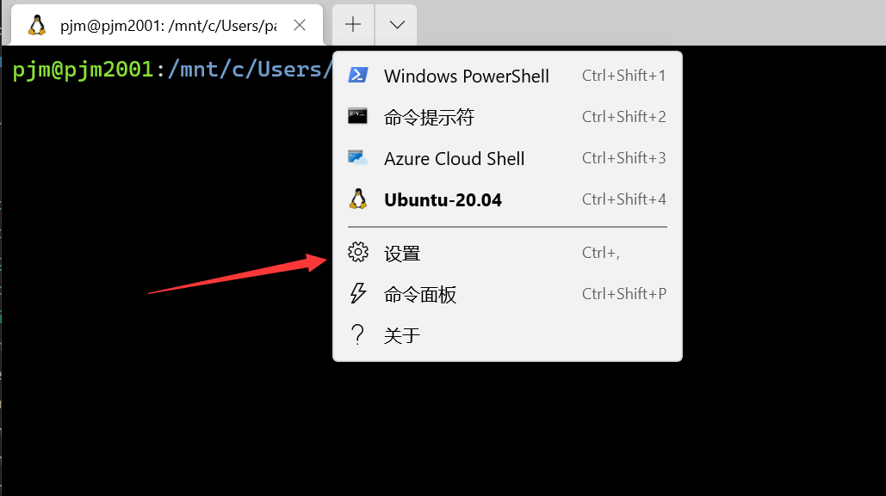
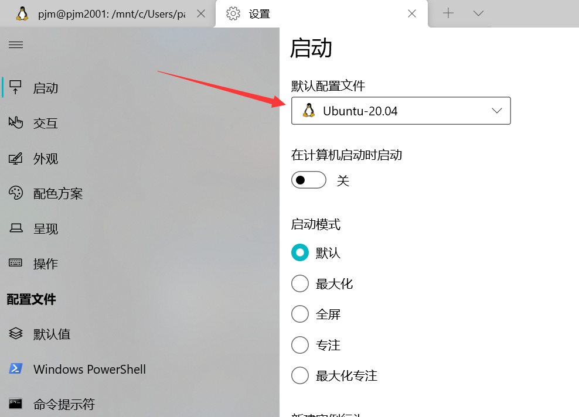

### 介绍 `WSL`
`WSL` 是 `Windows Subsystem for Linux` 的缩写，译为适用于`Linux` 的 `windows` 子系统。`WSL` 功能推出之前，在 `Windows` 上运行 `Linux` 需要将 `Linux` 发行版安装在虚拟机（比如 VMware、VirtualBox），使用此方法过程比较繁琐，容易出错，而且使用虚拟机运行 `Linux` 个人觉得比较占用系统资源。现在使用 WSL ，只需要在微软商店安装相应的 `Linux` 发行版，就可以在本地环境中体验到 `Linux` 的所有功能。

当然如果你想体验 `Linux` 发行版的图形界面，WSL 是不支持的，这个时候还只有使用虚拟机或者安装 `Linux` 在本地磁盘两种方法了。

接下来我们就开始配置 `Windows` 终端 & `WSL` 开发环境。

---

### 设置 `WSL`

#### 开启 WSL

打开「控制面板」>「程序」>「启用或关闭 Windows 功能 」，然后在「适用于 Linux 的 Windows 子系统」选项前面打勾。

小技巧：使用快捷键 Win+s 打开搜索功能，在搜索框中输入关键字 `Windows 功能`，可以快速打开「启用或关闭 Windows 功能」。

#### 安装 Ubuntu
在 微软商店 可以搜索到很多 Linux 发行版，我推荐 [Ubuntu](https://www.microsoft.com/zh-cn/p/ubuntu/9nblggh4msv6?activetab=pivot:overviewtab)，因为它对新手会比较友好一点。当然你可以根据个人喜好选择 Debian，kail Linux 或者 SUSE Linux 等等 Linux 发行版。

#### 创建用户
安装完成后，第一次启动 Ubuntu 会要求创建一个用户和登录密码，全部设置完成后即可运行。

---

### Windows Terminal

#### Windows Terminal 介绍
Windows 终端是一个面向命令行工具和 shell（如命令提示符、PowerShell 和适用于 Linux 的 Windows 子系统 (WSL)）用户的新式终端应用程序。 它的主要功能包括多个选项卡、窗格、Unicode 和 UTF-8 字符支持、GPU 加速文本呈现引擎，还可以用于创建你自己的主题并自定义文本、颜色、背景和快捷键绑定。

#### 安装 Windows Terminal
[Windows Terminal](https://www.microsoft.com/zh-cn/p/windows-terminal/9n0dx20hk701?rtc=1&activetab=pivot:overviewtab)

#### 设置 Windows Terminal

打开Windows terminal，打开设置菜单

选择 Ubuntu 20.04

至此，WSL2安装基本完成。

### 写在结尾
Linux的学习是枯燥且乏味的。希望读者在接下去的学习中保持热情，多多实践。

Linux的命令有很多，本教程只是列出了其中经常用到的一点点。在以后的工作学习中，希望读者能够边用边查。

最后，终生学习，共勉。